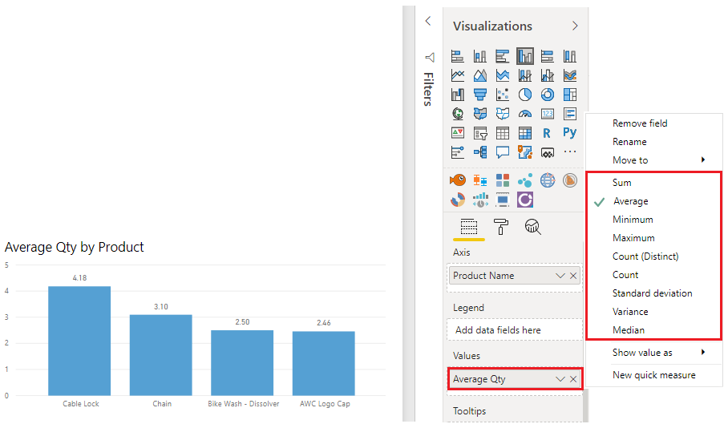
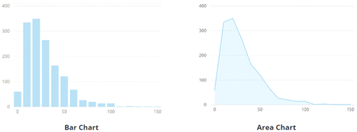
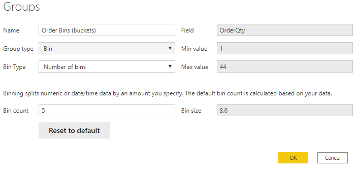
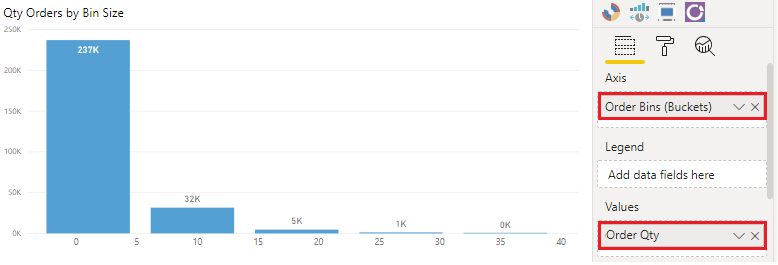
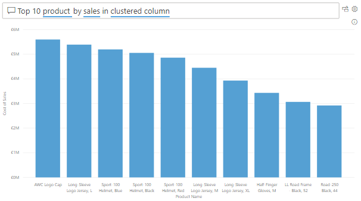
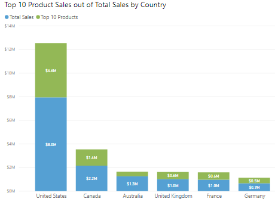

Data is often intertwined with statistics, for statistics are one way in which you can explore your data. Statistics show you the distribution of your data, and help you to identify key takeaways and trends, and see if there are any outliers.

The statistical summary is the information that provides a quick and simple description of your data. Power BI has many functions that help you to carry out a statistical analysis, such as Data Analysis Expressions (DAX) functions, visuals such as histograms and bell curves, advanced analytics visuals, and statistical programing languages such as Python and R.

Exploring the statistical summary gives the end-user a high-level view of the available data, where they can see clusters, patterns on behavioral data, data averages and more. They can gain insights about their data that will drive business decisions.

Suppose you are asked by the Supply Chain team to create a report. The team is particularly interested in the frequency of orders for certain products, and what the top 10 products are in terms of sales.

## Statistical functions

Power BI Desktop has a number of DAX functions that you can use to get quick statistics based on your data. You can access these quick functions by right-clicking on value field in the **Visualizations** pane, as illustrated in the following image.

> [!div class="mx-imgBorder"]
> [](../media/2-statistical-functions-ssm.png#lightbox)

However, to avoid any performance issues, it's better to create the statistical measures yourself, using DAX functions to calculate the average, sum, min, max and so on. For example, to analyze the inventory data to find the average order quantity per product, you could use the following formula:

```dax
Average Qty =
AVERAGE ( Sales[Order Qty] )
```

## Histogram

Histograms and bell curves are the most common way to display statistics about your data sets. In Power BI terms, you can represent a histogram with one of the bar or column chart visuals, and represent a bell curve with an area chart visual, as illustrated in the following image. You can also use the Q&A visual to ask a direct question about the top or bottom items in a list -- you'll learn about that in the next section.

> [!div class="mx-imgBorder"]
> [](../media/2-bar-area-charts-ss.png#lightbox)

A typical bar or column chart visual in Power BI relates two data points - a measure and a dimension. A histogram differs slightly from a standard bar chart in that it only visualizes a single data point.

In this example, you use the **Clustered Column Chart** visual to present a histogram that determines the order quantities by orders sizes.

You start by selecting the **Clustered Column Chart** icon on the **Visualization** pane. Next, you need to create a new grouping for the X-axis. You will learn about grouping and binning in more detail in a subsequent unit, but they are useful in this context also.

To create the group, in the **Fields** pane, right-click on the data field that you want to analyze, then select **New Group**. In this case, you use the **OrderQty** field. In the **Groups** window that displays, set up the bin group as follows:

-   Rename the group as *Order Bins (Buckets)*.

-   Set the **Group type** option to **Bin**, and the **Bin Type** option to **Number of Bins**.

-   Enter 5 as the **Bin count**, 1 as the **Min value** and 44 as the **Max value**.

> [!div class="mx-imgBorder"]
> [](../media/2-add-group-histogram-ss.png#lightbox)

Next, populate the visual as follows:

-   Drag and drop the **OrderQty** field from the **Fields** pane into the **Value** field on the **Visualizations** pane.

-   Drag and drop the **Order Bins (Buckets)**, group from the **Fields** pane into the **Axis** field on the **Visualizations** pane.

> [!div class="mx-imgBorder"]
> [](../media/2-set-up-histogram-ssm.png#lightbox)

You'll see on the visual now that the data is grouped into buckets on the X-axis, with the order quantities of that variable on the Y-axis.

You have now produced a histogram that displays the order quantity (**OrderQty** field) by order size buckets for the Supply Chain team.

## Top N analysis 

The TOPN DAX function returns the top N rows of a specified table. The top N analysis is a great way to present data that might be important, such as the top 10 selling products, top 10 performers in an organization or top 10 customers. You can also look at this from the other perspective and present the bottom 10 items in a list, in other words the worst performers. Depending on the requirements, you might want to use one or both of these options.

In this example, the Supply Chain team wants to know what the top 10 selling products are. You can do this in three ways: use a Q&A visual, use a Top N filter, or write a DAX formula.

### Use Q&A visual to find the top N

Suppose you've created a report for the Supply Chain team and the team members now have questions about various other views or insights they are interested in. Power BI has a built-in Q&A visual that allows users to ask their own questions and get answers, so you do not have to address each individual question yourself. The Q&A visual is an effective tool, as it allows users to quickly get answers about the data independently, which saves time for everyone involved. The Q&A visual is unique in that it does not require knowledge of Power BI to use the visual -- users simply have to ask their question and they too can create insightful visuals.

Add the **Q&A** visualization to your report, then reposition the visual and customize its formatting as required.

> [!div class="mx-imgBorder"]
> [](../media/2-add-question-answer-visual-ssm.png#lightbox)

Now you can use the visual to get answers. In this case, you want to know what the top 10 selling products are, so you enter a question, such as, "*What are my top 10 products by sales"*. Power BI will automatically display those results for you.

> [!div class="mx-imgBorder"]
> [](../media/2-use-question-answer-find-top-n-ss.png#lightbox)

### Use a Top N filter type

Top N is a filtering option available on the **Filters** pane. Select the field you want to analyze on your report page, in this example it is the **Product Name** field. Then, in the **Filters** pane, expand the **Filter type** list and select **Top N**. In the **Show items** settings, select **Top** and **10**. Then select **Cost of Sales** as the value you want to filter the field by. The visual updates accordingly.

> [!div class="mx-imgBorder"]
> [](../media/2-use-filter-find-top-n-ssm.png#lightbox)

### Use a TOPN DAX function 

You can also calculate your Top 10 Products in DAX, using the TOPN function. This option could very useful if you want to present the top 10 in a different context, such as how much of the top 10 best-selling products contributed towards the overall total sales.

You start by creating a new measure called Top 10 Products. You then use the TOPN function, along with the SUMX function, to calculate your top 10 products by total sales, as follows:

```dax
Top 10 Products =
SUMX ( TOPN ( 10, Product, Product[Product Name], ASC ), [Total Sales] )
```

In the following image, you can clearly see how much the top 10 products contribute towards the overall sales.

> [!div class="mx-imgBorder"]
> [](../media/2-use-dax-function-calculate-top-n-ss.png#lightbox)

You can tweak the DAX formula to present same result in percentages.

If you are interested in learning more about the statistical capabilities of Power BI, see [Statistical Functions - DAX](https://docs.microsoft.com/dax/statistical-functions-dax/?azure-portal=true).

