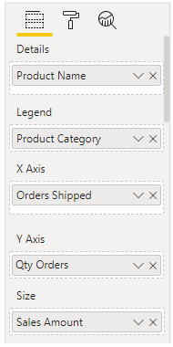
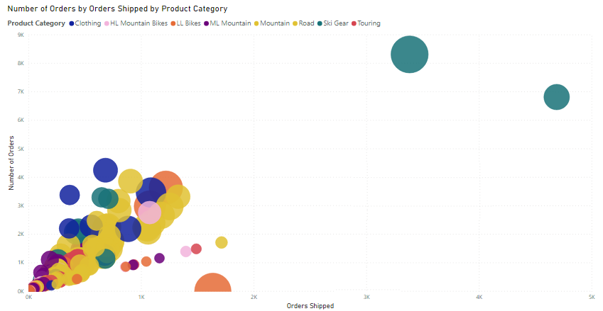
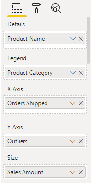
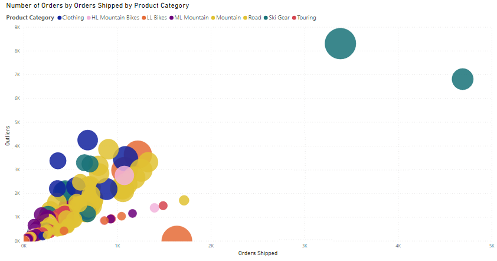

An outlier is a type of anomaly in your data - something that you didn't expect or that surprised you, based on historical averages or results. You will want to identify outliers to isolate data points that significantly differ from other data points, then take action to investigate the reasons for the differences. The results of this analysis can make a huge impact on business decision making.

Imagine you are analyzing data for a shipping warehouse. You notice that number of orders spiked up above average for specific product category. You first want to identify which product category it is. Then, you want to ask several questions about the outlier. Was there above average shipments that day? Was it just a specific warehouse? Did a single event cause the spike in orders for specific category? Were there any other days like this in the last month, quarter, year, or prior year?

Power BI allows you to easily identify outliers in your data but you need to first determine the logic behind what constitutes an outlier. You can use trigger points, such as calculations, around what you would consider the outlier to be.

The process of identifying outliers involves segmenting your data into two groups; one group is the outlier data and the other group is not. You could use calculated columns to identify outliers but the results would be static until you refresh the data. A better way to identify outliers is to use a visualization or DAX formula, as these methods will ensure your results are dynamic.

When you have identified the outliers in your data, you can then use slicers or filters to highlight those outliers, and add a legend to your visuals, so the outliers can be easily identified amongst the other data. You can then drill in to the outlier data for more detailed analysis.

## Use a visual to identify outliers

The best visual to use to identify outliers is the scatter chart, which shows the relationship between two numerical values. Scatter charts display patterns in large sets of data and are therefore, ideal for displaying outliers.

When you add a scatter chart to your Power BI report, you put the interesting fields in the **X axis** and **Y axis** sections respectively. In our case, the **Orders Shipped** field is on the X axis and the **Qty Orders** field on the Y axis.

> [!div class="mx-imgBorder"]
> [](../media/3-add-scatter-chart-ss.png#lightbox)

The visual will update to display the data according to the selected fields, and you'll be able to clearly spot the outliers in that data -- they are the isolated items that are away from the bulk of the data.

> [!div class="mx-imgBorder"]
> [](../media/3-scatter-chart-outlier-ss.png#lightbox)

Now that you can identify the outliers in your data, you can investigate the reasons for their existence and take corrective action.

## Use DAX to identify outliers

You can use DAX to create a measure that will identify the outliers in your data, such as in the following formula:

```dax
Outliers =
CALCULATE (
    [Order Qty] ),
    FILTER (
        VALUES ( Product[Product Name] ),
        COUNTROWS ( FILTER ( Sales, [Order Qty] >= [Min Qty] ) ) > 0
    )
) 
```

When you have created a new outlier measure, you can group your products into categories using the grouping feature, as you did when creating a histogram earlier. You then need to add a scatter chart visual, as you did in the previous section, as this the best visualization option for displaying outliers. When you've added the scatter chart, you populate it with the fields associated with your DAX formula and outlier measure.

> [!div class="mx-imgBorder"]
> [](../media/3-select-outlier-logic-fields-ss.png#lightbox)

Again, in the scatter chart, you'll be able to identify the outliers in your data. You can then investigate the reasons for their existence and take corrective action.

> [!div class="mx-imgBorder"]
> [](../media/3-scatter-chart-populate-outliers-ss.png#lightbox)
