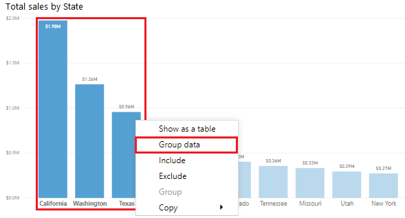
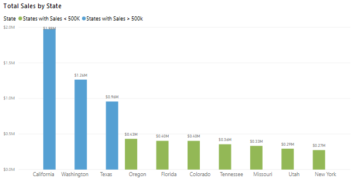
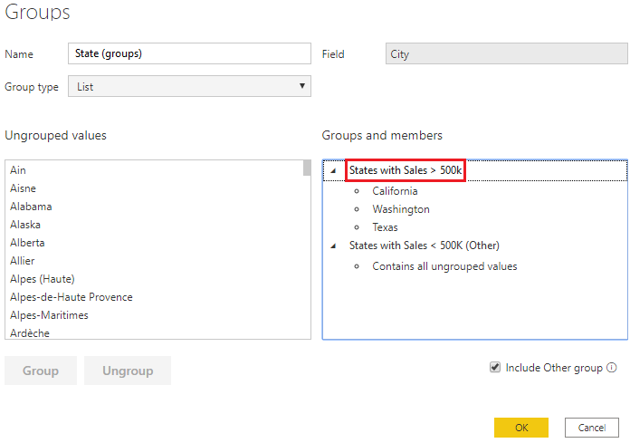
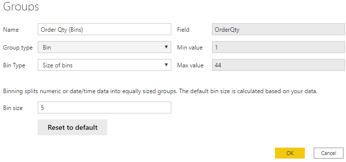

When you create visuals, Power BI Desktop aggregates your data into groups, based on the values that it finds in the underlying data. You can refine how those default groups are presented. You can also create new groups by grouping two or more data points in a visual or putting values into equal-sized groups (binning).

Grouping is used for categories of data. Binning is similar to grouping, but it is used for grouping continuous fields, such as numbers and dates.

You can use the grouping and binning features to ensure that the visuals in your reports display your data according to your preference. Using these features will help you to clearly view, analyze, and explore the data and trends in your visuals. Additionally, you'll be able to identify clusters, patterns of behavior, data averages, and more. The results of this analysis will provide your users with more specific insights on their data, which can help drive business decisions.

In this example, the Customer Service team has returned to you, greatly impressed by the analysis that you have done. Now, they want you to further analyze their Help ticket data, asking if you can segment the data into different groups and clusters. In particular, they want to identify the cities with the highest sales.

## Create a group

The following image shows a bar chart in which Power BI has automatically segmented the data in the way that it found most useful: Total Sales by City. However, you want to group some of the bars (cities) together so that you can view them as one category, which will help the Sales team identify the cities with the highest sales.

To create the group, use **Ctrl + click** to select the data points on the visual that you want to group. In this case, it's cities with sales greater than 500,000 dollars. Right-click one of those selected data points and then select the **Group data** option.

> [!div class="mx-imgBorder"]
> 

When the group is created, notice that the visual updates to take into account the new group. The following image shows that the other cities, which are the cities with lower sales (less than 500,000 dollars) have been grouped together and are highlighted in a different shade.

> [!div class="mx-imgBorder"]
> 

The new group field displays in the **Legend** bucket for the visual and is listed in the **Fields** pane.

When you create a group, you can change the way that the data is displayed in the visual. For example, you might want to switch the values in each axis. You can also use the group in any of the other visuals in your report. To do so, drag the group field from the **Fields** pane and then drop it into the visual in which you want to use it.

## Edit a group

Continuing with the previous example, you now want to edit the categories that make up your group. Right-click the group field in either the **Legend** bucket or the **Fields** pane, and then select **Edit Groups**.

In the **Groups** window that displays is a list of the groups and the different items within those groups. The following image shows the **Cities with Sales > 500k** group and its members, along with the **Other** group (**Cities with Sales < 500k**) that contains all other values that have not been put into the first group. If you refresh your data, and new items appear in the ungrouped values list, they'll all go into the **Other** group.

> [!div class="mx-imgBorder"]
> 

You can now make changes to the group. You can rename any group by double-clicking the group title in the **Groups and members** section and entering a new name. You can add ungrouped values into an existing group, remove values from an existing group, and create a new group.

## Create bin groups

The process of binning allows you to group your numerical and time field data into "bins" of equal size. This approach allows you to visualize and identify trends in your data in more meaningful ways. Binning allows you to right-size the data that Power BI Desktop displays.

In this example, you want to create bins (groups) for the **Order Qty** field. Start in the **Fields** pane by right-clicking the **Order Qty** field that you want to create the bins for, and then select **New Group**. On the **Groups** window that displays, set the **Bin size** to the size that you want, adjust other settings as required, and then select **OK**.

> [!div class="mx-imgBorder"]
> 

When you have set up the bin group, you'll see a new field in the **Fields** pane with **(bins)** appended to its name. You can then drag that field onto the canvas to use the bin size in a visual.
