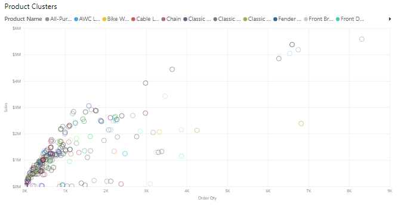
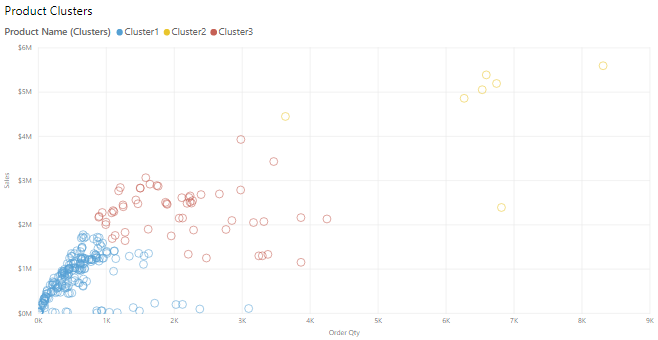
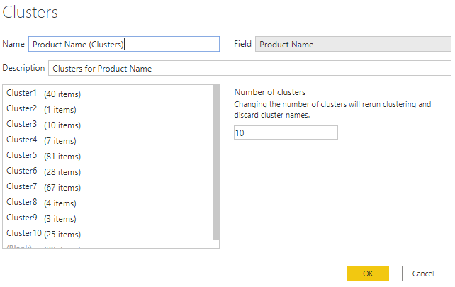

Clustering allows you to identify a segment (cluster) of data that is similar to each other but dissimilar to the rest of the data. The process of clustering is different to that of grouping, which you accomplished previously.

The Power BI clustering feature allows you to quickly find groups of similar data points in a subset of your data. It analyzes your dataset to identify similarities and dissimilarities in the attribute values, and then it separates the data that has similarities into a subset of the data. These subsets of data are referred to as clusters.

For example, you might want to look for patterns in your sales data, such as the behavior of customers overall. You can segment the customers into clusters according to their similarities, such as age or location.

Start by adding the scatter chart visualization to your report and then add the required fields to the visual. In this example, you will add the **Order Qty** field to the x-axis, the **Sales** field to the y-axis, and the **Product Name** field to the **Legend** section. The following image shows considerable data in the scatter chart, so it is difficult to discern any natural groups.

> [!div class="mx-imgBorder"]
> 

To apply clustering to your scatter chart, select **More options** (**...**) in the upper-right corner of the visual and then select **Automatically find clusters**.

On the **Clusters** window that displays, you can edit the default name, field, and description, if required. However, for this example, you want to change the number of clusters. The following image shows that the **Number of clusters** box is blank by default, which means that Power BI automatically finds the number of clusters that it determines as making the most sense with your data.

> [!div class="mx-imgBorder"]
> 

Enter the number of clusters that you want (3) into the box and then select **OK**. Power BI will run the clustering algorithm and create a new categorical field with the different cluster groups in it. Now, when you look at the visual, you can clearly see the clusters that are in your data and proceed to perform analysis on them.

> [!div class="mx-imgBorder"]
> 

The new cluster field is added to your scatter chart's **Legend** field well bucket, which you can now use as a source of cross-highlighting like any other **Legend** field. You can also find the new cluster field in your field list and use it in new visuals, just like any other field.

If you want to edit the cluster, right-click the cluster field and select **Edit clusters**.

> [!div class="mx-imgBorder"]
> 

In the preceding example, when you applied clustering to the scatter chart, you could only use two measures. If you want to find clusters by using more than two measures, you can use a table visual instead, add all the fields you want to use, and then run the clustering algorithm by using the same process.
