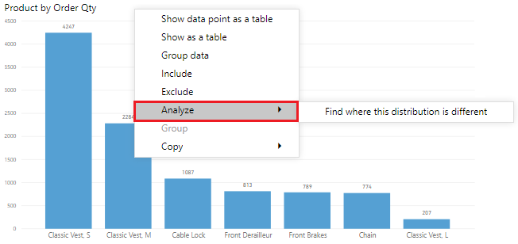
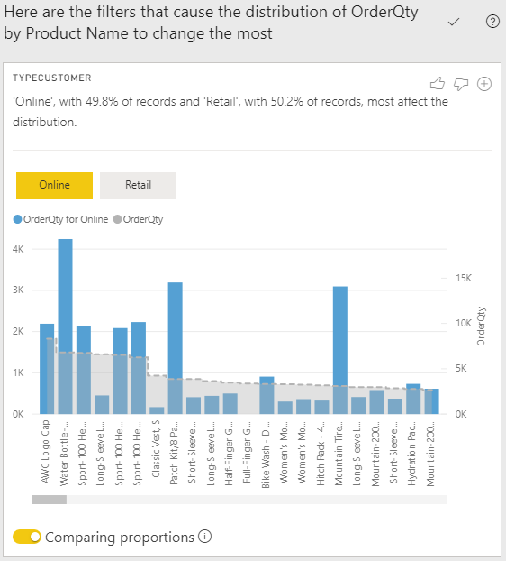

The **Analyze** feature provides you with additional analysis that is generated by Power BI for a selected data point. You might want to use this feature to determine if Power BI has found something that you haven't seen before, or if you want Power BI to give you a different insight into your data. This feature is particularly useful for analyzing why your data distribution looks the way that it does.

> [!NOTE]
> This feature does not work if you have non-numeric filters applied to your visual and/or if you have measure filters applied.

In this example, you are developing a report for the Customer Service team that deals with Help tickets. They want to analyze the ticketing data that is created online when a customer asks a question. You've created a preliminary visual to display data for tickets by location, but you're now curious about why the distribution of your data looks the way that it does.

Instead of exploring the data manually, you can use the **Analyze** feature to get fast, automated, insightful analysis of your data.

To use the **Analyze** feature, right-click a data point on the visual and then hover over the **Analyze** option to display two further options: **Explain the increase** and **Find where the distribution is different**. The options that are available will depend on the data point that you selected.

> [!div class="mx-imgBorder"]
> 

In this example, you select the **Explain the increase** option, and a window displays with a new visual, as illustrated in the following image.

> [!div class="mx-imgBorder"]
> 

If you find this analysis useful, you can add the new visual to your report so that other users can view it. Select the plus (**+**) icon in the upper-right corner of the visual to add it to your report.

For more information about the Analyze feature, see [Apply insights in Power BI Desktop to discover where distributions vary (preview)](https://docs.microsoft.com/power-bi/create-reports/desktop-insights-find-where-different/?azure-portal=true).
