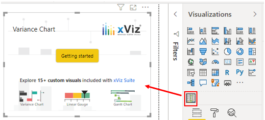
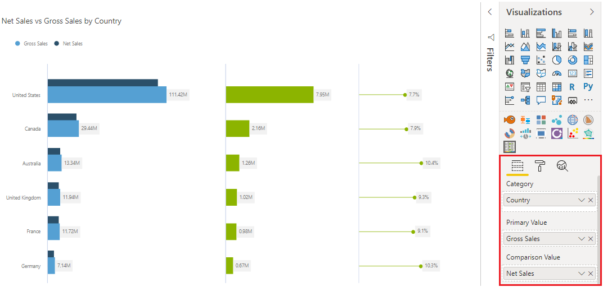

In addition to the out-of-the-box visualizations that you see in Power BI Desktop, Microsoft AppSource has a vast library of custom visuals that you can import into Power BI Desktop. These custom visuals give you a wider choice of options when it comes to using advanced analytics. A custom visual might exist that solves a business problem that the standard visuals can't solve, or you might find one that presents your data in a way that the standard visuals can't.

> [!NOTE]
> Some organizations prefer not to use custom visuals, or only permit certain custom visuals, for security or other reasons. Before you import custom visuals, check with your organization to see whether they are allowed or not. If they are not allowed, you can still create reports in Power BI Desktop with them, but they will not render in Power BI service.

Previously, you imported a custom visual from Microsoft AppSource for the purposes of time series analysis. For this example, you'll focus on the range of Advanced Analytics custom visuals that are available. These custom visuals include box-and-whisker plots, variance charts, hierarchical trees, Gantt plots, clustering plots, and much more. Using advanced analytics visuals adds a layer of complexity to your reports and allows you to further analyze the data and develop granularity within your visuals.

In this example, you've produced some charts and visuals for the Customer Service team, but now they want you to create a variance chart so they can study the variance in the Help tickets. You decide to browse Microsoft AppSource to see if an advanced analytics visual exists that you can use to satisfy this request.

In the **Visualizations** pane, select the **Get more visuals** icon and then select **Get more visuals**. On the **Power BI Visuals** window that displays, select the **Advanced Analytics** category. Browse the available options and then select the **Add** button for the visual that you want to import. In this example, you will add the **Variance Chart** custom visual.

> [!div class="mx-imgBorder"]
> 

When the visual has been imported, an icon for the new custom visual displays under the other visual icons in the **Visualizations** pane.

> [!div class="mx-imgBorder"]
> 

You can then add fields to the new visual and customize it in the same way that you would for any other visual. In this example, you will add **Country** to the **Category** field, **Gross Sales** to the **Primary Value** field, and **Net Sales** to the **Comparison Value** field.

Then, you should notice that you have a variance visual that contains multiple charts, which is a task that you couldn't complete without importing the Advanced Analytics custom visual from AppSource.

> [!div class="mx-imgBorder"]
> 

