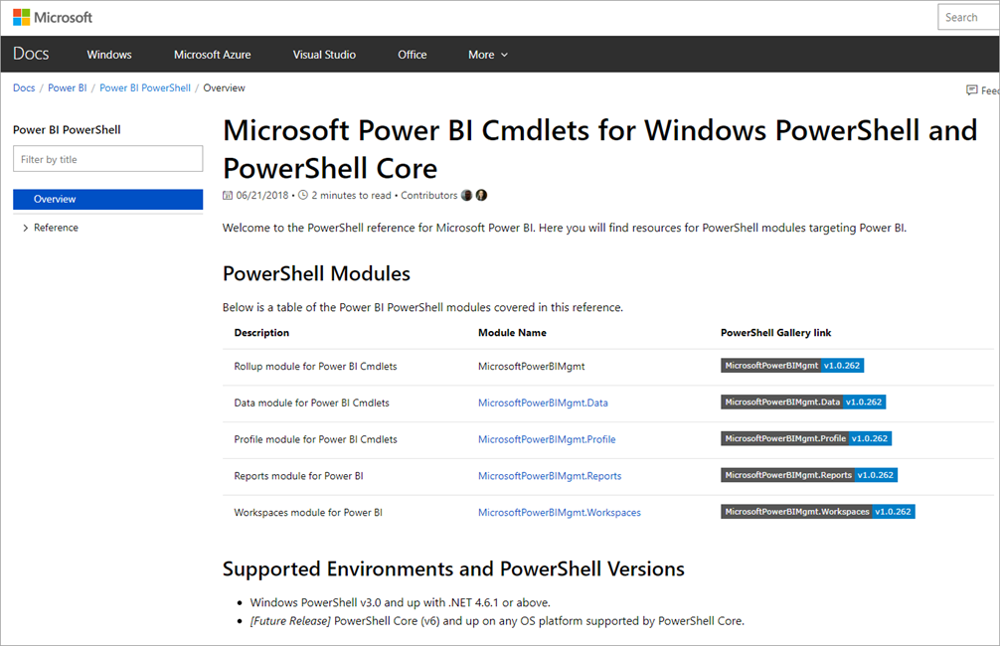

A cmdlet is a lightweight command that is used in the PowerShell environment. Cmdlets perform an action and typically return a Microsoft .NET object to the next command in the pipeline. A cmdlet is a single command that participates in the pipeline semantics of PowerShell including binary (C#) cmdlets, advanced script functions, CDXML, and Workflows.

There are many resources for PowerShell modules targeting Power BI. The following chart displays several of them. For access to the full list of available cmdlets, refer to [Microsoft Power BI Cmdlets for Windows PowerShell and PowerShell Core.](/powershell/power-bi/overview?view=powerbi-ps/?azure-portal=true)

> [!div class="mx-imgBorder"]
> 
