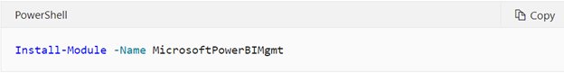
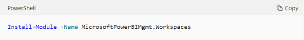
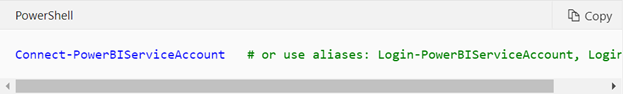
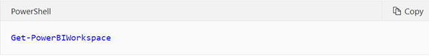
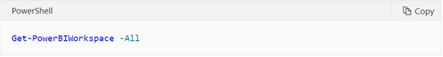
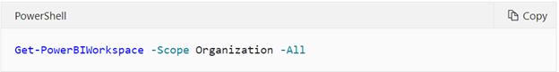

The cmdlets are available on PowerShell Gallery and can be installed in an elevated PowerShell session.

Some of the common and most frequently used Power BI Cmdlets are provided below. 

## Installation

> [!div class="mx-imgBorder"]
> 

For example, if you only wanted the Workspaces module, you could install individual modules (based on your needs) instead of the rollup module.

> [!div class="mx-imgBorder"]
> 

## Log in to Power BI

> [!div class="mx-imgBorder"]
> 

## Get workspaces

Get workspaces for the user. By default, for example - without -first parameter, it shows the first 100 workspaces assigned to the user.

> [!div class="mx-imgBorder"]
> 

Use the -All parameter to show all workspaces assigned to the user.

> [!div class="mx-imgBorder"]
> 

If you are a tenant administrator, you can view all workspaces in your tenant by adding -Scope Organization.

> [!div class="mx-imgBorder"]
> 

For additional commonly used Power BI cmdlets, see [Microsoft Power BI Cmdlets for Windows PowerShell and PowerShell Core](https://docs.microsoft.com/powershell/power-bi/overview?view=powerbi-ps/?azure-portal=true).
