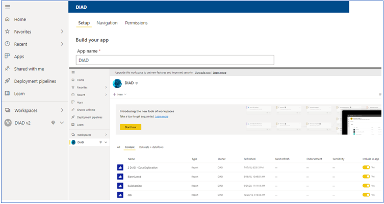

> [!div class="mx-imgBorder"]
> 

The option to view your Apps is found in the Power BI admin portal menu located at the upper left part of the main screen.

If you're in a workspace, you'll find in the upper right corner of the screen a button that will allow you to create an App if you currently have none in the workspace or update any Apps that were previously created in the workspace.
