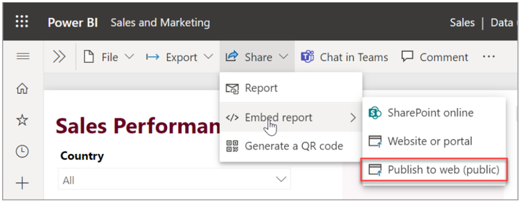
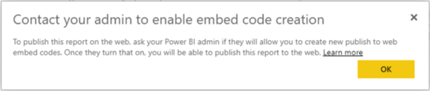
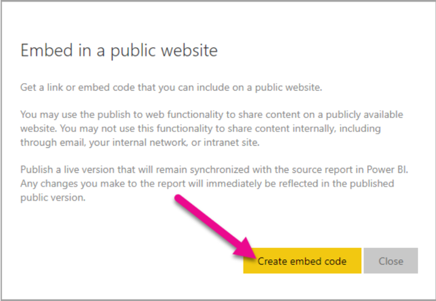
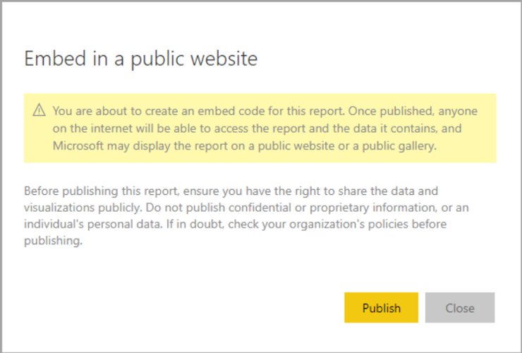
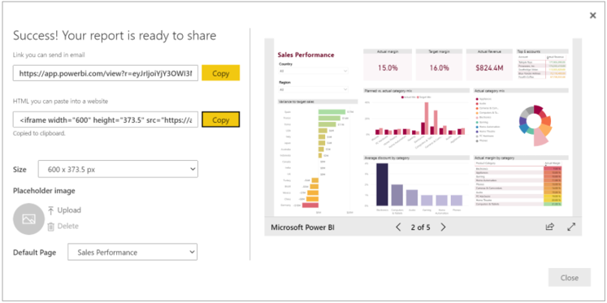
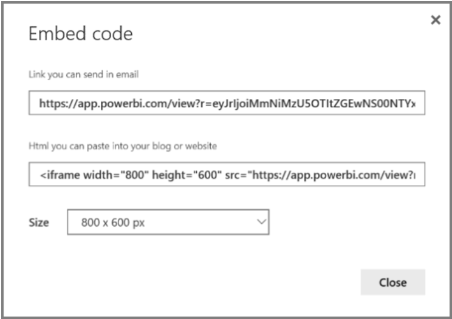

With the Power BI Publish to web option, you can easily embed interactive Power BI content in blog posts, websites, emails, or social media. You can also easily edit, update, refresh, or stop sharing your published visuals.

> [!Note]
> Publish to web is disabled by default. Power BI admins can enable this feature in the Admin portal tenant settings export and sharing settings.

> [!Warning]
> **Proceed with caution**. When you use Publish to web, anyone on the Internet can view your published report or visual. Viewing requires no authentication. These factors of Publish to web make it an excellent option for publishing public relations material. It includes viewing detail-level data that your reports aggregate. Before publishing a report, make sure it's okay for you to share the data and visualizations publicly. Don't publish confidential or proprietary information. If in doubt, check your organization's policies before publishing.

The following steps describe how to use Publish to web.

1. Open a report in a workspace that you can edit and select **More options (...)** > **Embed** > **Publish to web (public)**.

   > [!div class="mx-imgBorder"]
   > 

1. If your Power BI admin hasn't allowed you to create embed codes, you may need to contact them.

   > [!div class="mx-imgBorder"]
   > 

   > [!tip]
   > For help finding the person who can enable Publish to web in your organization, see [How to find your Power BI administrator](https://docs.microsoft.com/power-bi/collaborate-share/service-publish-to-web?azure-portal=true#find-your-power-bi-administrator).

1. Review the dialog content and select Create embed code.

   > [!div class="mx-imgBorder"]
   > 

1. Review the warning, as shown here, and confirm that the data is okay to embed in a public website. If it is, select **Publish**.

   > [!div class="mx-imgBorder"]
   > 

1. In the Success dialog, you see a preview of how the report will look. Select the **Size** and **Default page**.

   > [!tip]
   > You can also add a Placeholder image, to make the web page load faster. With a placeholder image, people viewing your report on the web see a **View interactive** **content** button they can select to view the report itself.
   >
   > Make those changes first. Then copy the link to send it in email or copy the HTML to paste into a website. You can embed it in code such as an iFrame or paste it directly into a web page or blog.
   >
   > [!div class="mx-imgBorder"]
   > 

1. If you previously created an embed code for a report and you select **Publish to web**, you won't see the dialogs in steps 2-4. Instead, you see the **Embed code** dialog.

   > [!div class="mx-imgBorder"]
   > 

> [!note]
> You can only create one embed code for each report.
