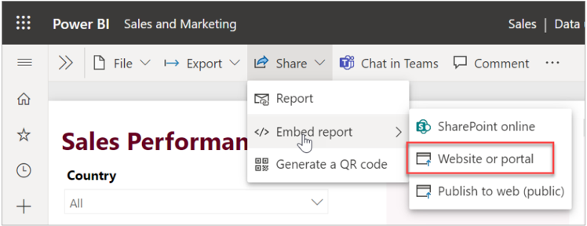
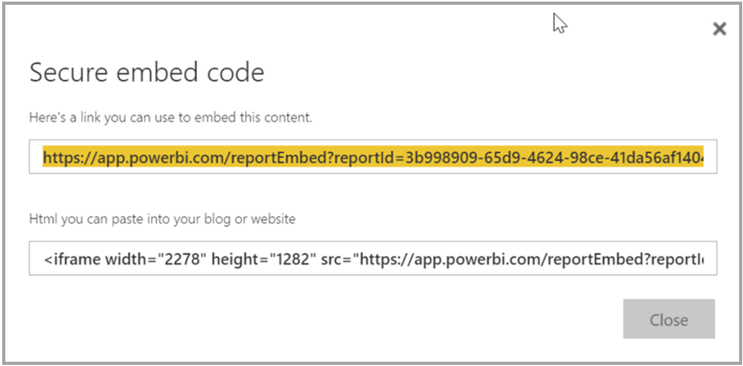
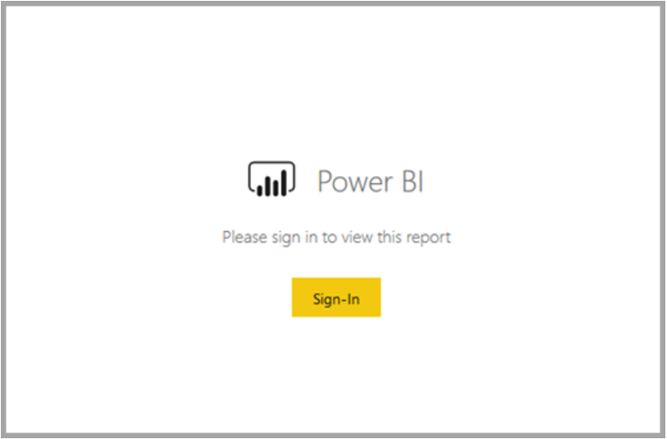
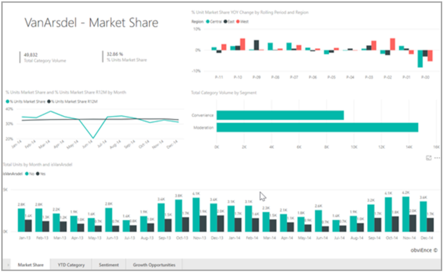
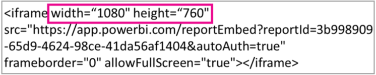

With the new **Embed** option for Power BI reports, you can easily and securely embed reports in internal web portals. These portals can be **cloud-based** or **hosted on-premises**, such as SharePoint 2019. Embedded reports respect all item permissions and data security through [row-level security (RLS)](https://docs.microsoft.com/power-bi/admin/service-admin-rls/?azure-portal=true). They provide no-code embedding into any portal that accepts a URL or iFrame.

The **Embed** option supports [URL filters](https://docs.microsoft.com/power-bi/collaborate-share/service-url-filters/?azure-portal=true) and URL settings. It allows you to integrate with portals using a low-code approach requiring only basic HTML and JavaScript knowledge.

## How to embed Power BI reports into portals

1. Open a report in the Power BI service.

1. On the **Share** menu, select **Embed report** > **Website or portal**.

   > [!div class="mx-imgBorder"]
   > 

1. In the **Secure embed code** dialog, select the **link you can use to embed this content**, or the **HTML you can paste into your blog or website** in an iFrame.

   > [!div class="mx-imgBorder"]
   > 

1. Whether a user opens a report URL directly, or one embedded in a web portal, report access requires authentication. The following screen appears if a user has not signed-in to Power BI in their browser session. When they select Sign-In, a new browser window or tab could open. Have them check for pop-up blockers if they don't get prompted to sign in.

   > [!div class="mx-imgBorder"]
   > 

1. After the user has signed in, the report opens, showing the data and allowing page navigation and filter setting. Only users who have view permissions can review the report in Power BI. All row-level security (RLS) rules are also applied. Lastly, the user needs to be correctly licensed. Either they need a Power BI Pro license, or the report must be in a workspace that is in a Power BI Premium capacity. The user needs to sign in each time they open a new browser window. However, once signed in, other reports load automatically.

   > [!div class="mx-imgBorder"]
   > 

   > [!tip]
   > When using an iFrame, you may need to edit the **height** and **width** to have it fit in your portal's web page.
   >
   > [!div class="mx-imgBorder"]
   > 

## Grant report access

The **Embed** option doesn't automatically permit users to view the report. View permissions are set in the Power BI service.

In the Power BI service, you can share embedded reports with users requiring access. If you're using a Microsoft 365 Group, you can list the user as a workspace member. For more information, see how to [manage your workspace in Power BI and Microsoft 365](https://docs.microsoft.com/power-bi/collaborate-share/service-manage-app-workspace-in-power-bi-and-office-365/?azure-portal=true).
