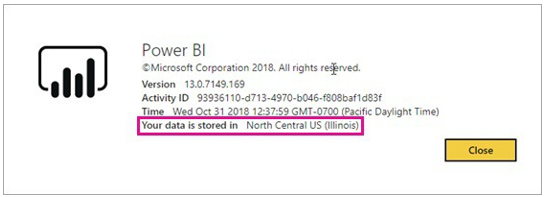
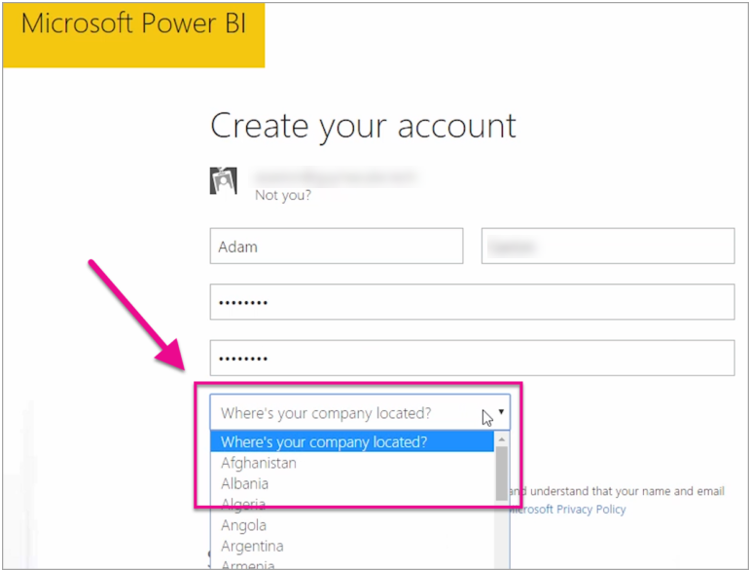

A Power BI tenant is an additional service subscription and a part of an Office 365 suite that is attached to a domain. Understanding the tenant location is important. It can affect the interactions you have with the service based on local governmental regulations such as privacy laws. 

When setting up a Power BI environment, you need to understand in which Azure data store the Power BI tenant will be located. Tenant location is based on an organization's Office 365 country or Azure Active Directory (AAD) data center.

As a Power BI admin, you should consider which other Azure resources Power BI will use. To avoid latency or Azure Egress charges, the Power BI tenant should reside in the same Azure region as other O365 services the organization uses.

## How to determine where your Power BI tenant is located

To find the region your tenant is in, follow these steps.

1. In the Power BI service, in the top menu, select help (**?**) then **About Power BI**.

1. Look for the value next to **Your data is stored in**. It's the region where your tenant is located. The value is also the region where your data is stored unless you're using capacities in different regions for your workspaces.

> [!div class="mx-imgBorder"]
> 

## How the data region is selected

The data region is based on the country or region you select when you create the tenant. The selection applies to sign up for both Microsoft 365 and to Power BI, because this information is shared. If this is a new tenant, select the appropriate country/region from the list when you sign up.

> [!div class="mx-imgBorder"]
> 

Power BI chooses a data region closest to your selection, which determines where data is stored for your tenant.

> [!Important]
> You cannot change the country selection after you create the tenant.

## Other things to keep in mind about tenant location

Keep the following in mind when considering tenant location:

- Power BI tenants are created in an Azure Data Center.

- Tenant location is based on Office 365 country or Azure Active Directory data center.

- Think about other Azure services the organization might be considering. Choosing the wrong location could result in Egress charges.

