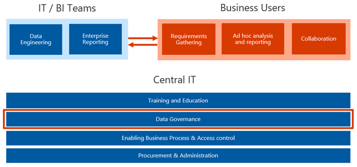

> [!div class="mx-imgBorder"]
> 

A critical role of a BI administrator is to enforce the governance of the BI environment.

There are three key groups that contribute to building the governance model in a normal BI ecosystem. Each group has assigned tasks and responsibilities. The three groups are the IT/BI team, the business users, and central IT.

The IT/BI team is responsible for designing models and processes for collecting, cleaning, and cataloging data. The IT/BI team is also responsible for developing rules that determine what reports are created and how they're distributed to the organization.

The business users' primary responsibilities are to research and document the BI system requirements, including needs for ad hoc analysis and reporting, and how users of the system will work together towards shared or common goals.

The third group, central IT, contributes to the development of several components of a BI governance model. Starting with training and education, which teaches users, administrators, auditors, and governors of the system how to optimize the output of the environment. Another component is data governance, or the process of governing and managing data to ensure the accuracy, completeness, integrity, and timeliness of data. A third component in our model is the enablement of business process and access controls to define the approval processes for who should be granted access to the system, what they can do in the system, and when they should have access to it. The last component is procurement and administration, which supports the purchasing and procurement of the BI system elements.
