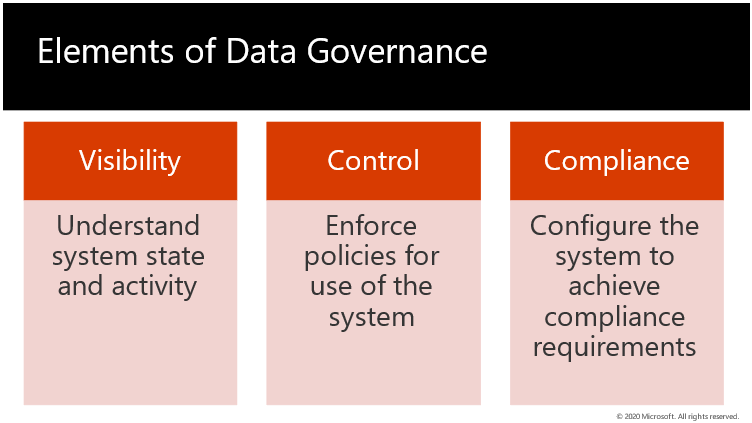

> [!div class="mx-imgBorder"]
> 

Data governance is the process of governing and managing data and ensures the accuracy, completeness, integrity, and timeliness of data.

The first element associated with BI data governance is visibility. As an administrator it's important to know what's going on in the Power BI environment.

Key information required by an administrator includes things like, what solutions are being deployed, whether users have access to them, and knowing what users are doing when using the solutions in their BI environment.

Another element of data governance is control. This includes the enforcement of policies dictating acceptable use of the system by defining who in the organization has authority and control over data assets and how those data assets may be used.

A third component of data governance is compliance. This means that processes are in place to control your data and ensure that all regulations are met in all your organization's data practices. Compliance starts with configuring your system to achieve compliance requirements.
