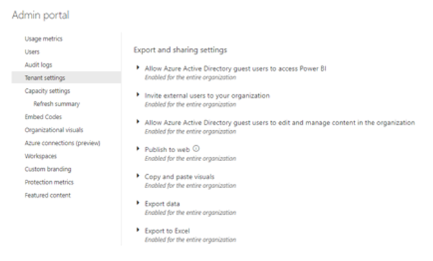

> [!div class="mx-imgBorder"]
> 

[Tenant settings](/power-bi/admin/service-admin-portal?azure-portal=true#tenant-settings) enable fine-grained control over the features that are made available to your organization and are managed in the [Admin portal](https://app.powerbi.com/admin-portal/tenantSettings/?azure-portal=true). Tenant settings can be configured by a global admin, Power BI service administrator, or Microsoft Power Platform service administrator. Many tenant settings can restrict capabilities and features to a limited set of users by assigning one of three states.

- **Disabled for the entire organization**: No one in your organization can use this feature.

- **Enabled for the entire organization**: Everyone in your organization can use this feature.

- **Enabled for a subset of the organization**: Specific security groups in your organization can use this feature.

For more information about creating, editing, or deleting security groups in Microsoft 365 Admin Center, review this [article](/microsoft-365/admin/email/create-edit-or-delete-a-security-group/?azure-portal=true).

An example of a commonly enabled tenant setting is - Publish to web. The Publish to web setting gives you options that let users create embed codes to publish reports to the web. This functionality makes the report and its data available to anyone on the web.

> [!Note]
> For security reasons, Publish to web is turned off by default.
