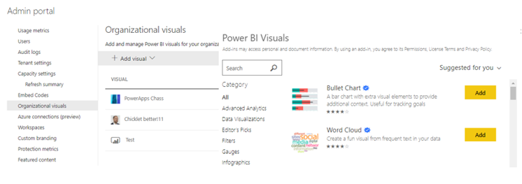

> [!div class="mx-imgBorder"]
> 

As a Power BI admin for your organization, you can establish the approval process for usage of custom visuals and control which type of Power BI visuals, including custom visuals, users can access across the organization.

To manage Power BI visuals, you must be a Global Admin in Office 365, or have been assigned the Power BI service administrator role. Organizational visuals are managed and can be distributed through the Power BI admin portal.

From the Power BI admin portal, you can manage the list of Power BI visuals available in your organization's [organizational store](https://docs.microsoft.com/power-bi/developer/visuals/power-bi-custom-visuals?azure-portal=true#organizational-store). The **Organizational visuals** tab in the **Admin portal** allows you to add and remove visuals, and decide which visuals will automatically display in the visualization pane of your organization's users. You can add to the list any type of visual including uncertified visuals and .pbiviz visuals, even if they contradict the [tenant settings](https://docs.microsoft.com/power-bi/admin/organizational-visuals?azure-portal=true#power-bi-visuals-tenant-settings) of your organization.

Organizational visuals settings are automatically deployed to Power BI Desktop. For additional information about organizational visuals, you may refer to this [article](https://docs.microsoft.com/power-bi/admin/organizational-visuals/?azure-portal=true).
