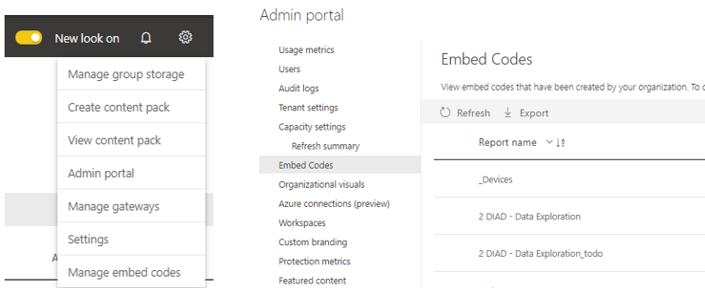

> [!div class="mx-imgBorder"]
> 

With the Power BI **Publish to web** option, you can easily embed interactive Power BI content in blog posts, websites, emails, or social media. You can also easily edit, update, refresh, or stop sharing your published visuals.

Once you create a **Publish to web** embed code, you can manage your codes from the **Settings** menu in Power BI. Managing embed codes includes the ability to remove the destination visual or report for a code (rendering the embed code unusable) or getting the embed code.

As a Power BI admin, you can control all embed codes in the tenant through the Power BI admin portal.
