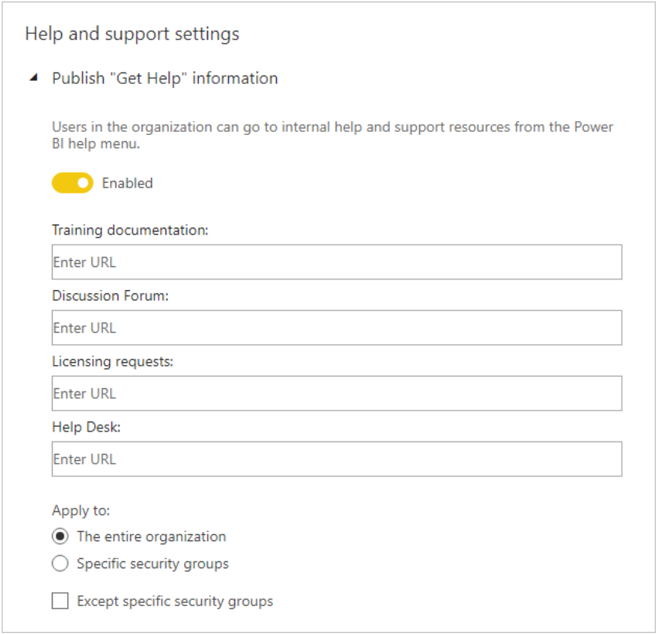
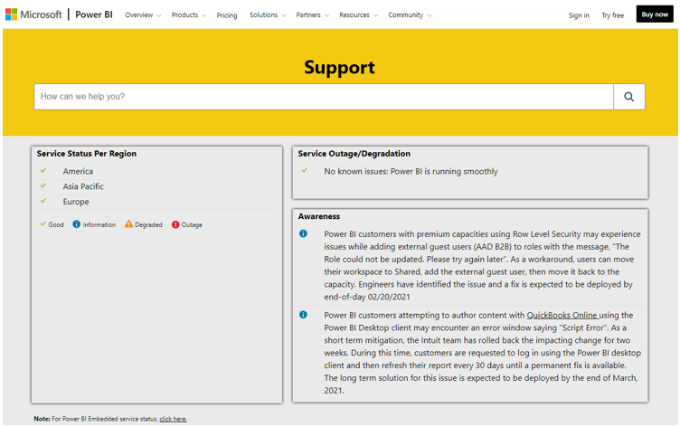

Power BI allows you to customize help and support links in the help menu to direct your users to specific organizational content.

It's encouraged that you set up internal Power BI-related sites using [Microsoft Teams](https://docs.microsoft.com/microsoftteams/?azure-portal=true), or some other collaboration platform. These sites can be used to store training documentation, host discussions, make requests for licenses, or respond to help.

If you do so, it's recommended that you enable the **Publish "Get Help" information** setting for the entire organization. It's found in the **Help and support settings** group. You can set URLs for your:

- Training documentation

- Discussion forum

- Licensing requests

- Help desk

These URLs will become available as links in the Power BI help menu.

To set up your custom help and support menu in your Power BI tenant, access the admin portal, select tenant settings, then select Publish "Get Help" information. Toggle the Disabled button to Enabled, and then provide appropriate URLs to your company's sites for training documentation, discussion forums, licensing requests, and help desk.

> [!div class="mx-imgBorder"]
> 

For Power BI Support and status use [https://support.powerbi.com](https://support.powerbi.com/?azure-portal=true)

> [!div class="mx-imgBorder"]
> 
