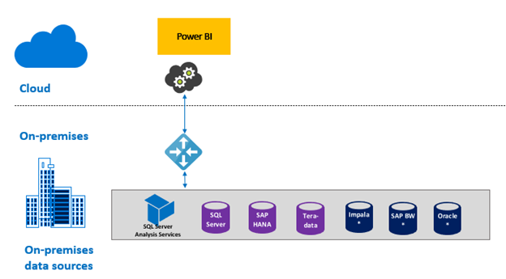

Let's review how the on-premises Active Directory property lookup to remap Azure AD UPNs to Active Directory users works. We can do this by breaking down the process into steps.

> [!div class="mx-imgBorder"]
> 

In the Power BI service, the following occurs:

1.  For each query by a Power BI Azure AD user to an on-premises SQL Server Analysis Services (SSAS) server, a UPN string is passed along, such as `firstName.lastName@contoso.com`.

> [!NOTE]
> Any manual UPN user mappings defined in the Power BI data source configuration are still applied before the username string is sent to the on-premises data gateway.

In the on-premises data gateway with configurable custom user mapping, the following occurs:

1.  The gateway looks for an Active Directory to search. This can be set to automatic or configurable.

1.  The gateway looks up the attribute of the Active Directory person, such as Email, from the Power BI service. The attribute is based on an incoming UPN string like `firstName.lastName@contoso.com`.

1.  If the Active Directory lookup fails, it attempts to use the passed-along UPN as EffectiveUser to SSAS.

1.  If the Active Directory lookup succeeds, it retrieves UserPrincipalName of that Active Directory person.

1.  The gateway passes the User PrincipalName email as EffectiveUser to SSAS, such as `Alias@corp.on-prem.contoso.com`.