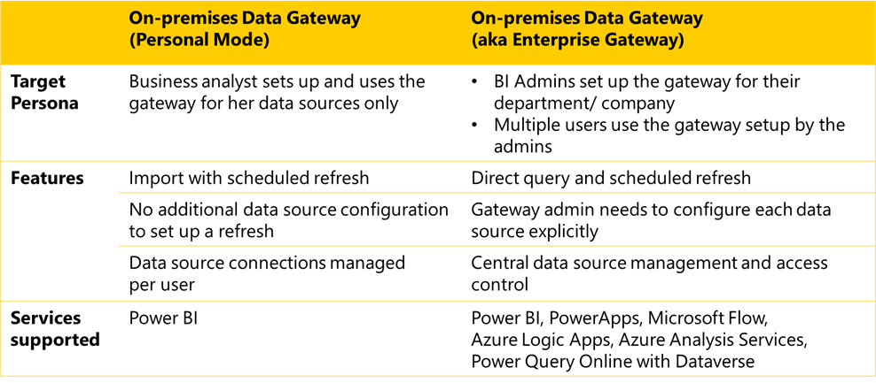

The on-premises data gateway acts as a bridge to provide quick and secure data transfer between on-premises data (data that isn't in the cloud) and several Microsoft cloud services. These cloud services include Power BI, Power Apps, Power Automate, Azure Analysis Services, and Azure Logic Apps. By using a gateway, organizations can keep databases and other data sources on their on-premises networks, yet securely use that on-premises data in cloud services.

## Types of gateways

There are two different types of on-premises data gateways, each for use in a different scenario:

-   **On-premises data gateway (also known as enterprise gateway)** allows multiple users to connect to multiple on-premises data sources. You can use an on-premises data gateway with all supported services, with a single gateway installation. This gateway is well suited to complex scenarios with multiple people accessing multiple data sources.

-   **On-premises data gateway (personal mode)** allows one user to connect to sources and can't be shared with others. An on-premises data gateway (personal mode) can be used only with Power BI. This gateway is well suited to scenarios where you're the only person who creates reports, and you don't need to share any data sources with others.

> The following chart presents the key differences between the two gateways.

> [!div class="mx-imgBorder"]
> 

The on-premises data gateway (personal mode) is installed on your laptop or personal computer.

Some key features of personal mode include the ability to import data with a scheduled refresh, no need for another data source configuration to set up a refresh, and data source connections are managed per user. If you import data with a scheduled refresh, you have the option to set the refresh frequency depending on which Power BI plan you are on.

> [!NOTE]
> The only services supported in personal mode is Power BI.

The enterprise gateway is typically set up by a BI admin or the IT department for use by a department or the whole company and is managed as an enterprise solution.

In this set up, the gateway will usually be installed on a server, or cluster of servers, depending on the anticipated workload.

Key features of an enterprise gateway include the use of direct query connectivity with scheduled refresh and that each data source must be explicitly configured by the gateway administrator. Also, an enterprise gateway supports central data source management and access control.

An enterprise gateway can be used for more than just Power BI, and can support access to PowerApps, Microsoft Flow, Azure Logic Apps, Azure Analysis Services, and Power Query Online with Dataverse.

For additional information regarding on-premises data gateways, review the following [video](https://community.powerbi.com/t5/MBAS-Gallery/Microsoft-Power-BI-Flow-and-PowerApps-Connecting-to-data-using/m-p/712575/?azure-portal=true).