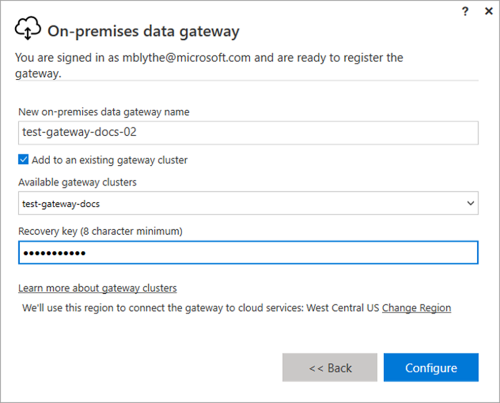

For large-scale deployments, you can create a gateway with multiple cluster members. You also have the option to install one or more gateways in a new or existing cluster. Clusters avoid single points of failure and can load balance traffic across gateways. If desired, you can isolate workloads to standalone gateways, or clusters of gateway servers.

The following graphic is a screenshot of the on-premises data gateway setup page.

> [!div class="mx-imgBorder"]
> 

When setting up a gateway in a new or existing server cluster, you are required to establish a recovery key. If you're joining an existing cluster, you must be the administrator of the original gateway.