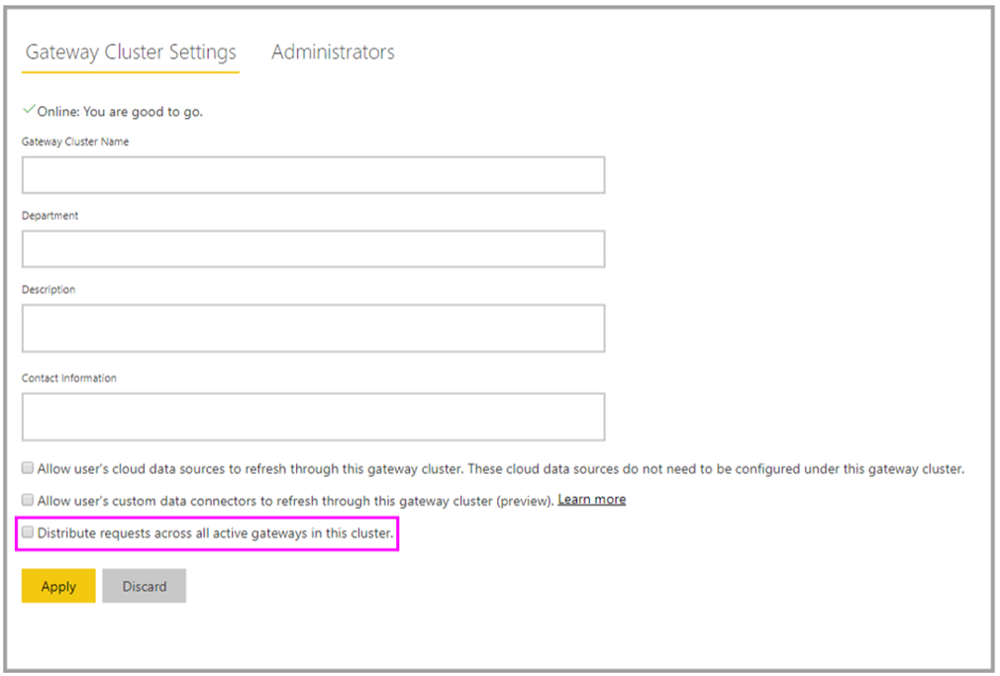

After you create a cluster of two or more gateways, all gateway management operations apply to every gateway in the cluster. These operations include granting administrative permissions to a gateway and adding data sources or connections.

For example, when admins select **Manage gateways** in Power BI, they see the list of registered clusters or individual gateways. But they don't see the individual gateway instances that are members of the cluster.

All requests are routed to the primary instance of a gateway cluster. If the primary gateway instance isn't online, the request is routed to another gateway instance in the cluster.

You can choose to let traffic be distributed evenly across gateways in a cluster. By default, the selection of a gateway during load balancing is random. You can change this setting to distribute the load.

For example, to provide load balancing from the Power BI service, select the gear icon in the upper-right corner of the Power BI admin portal screen, then select **Manage gateways**. Next, select **Distribute requests across all active gateways in this cluster**.

> [!div class="mx-imgBorder"]
> 

It is recommended to disable or remove an offline gateway member in the cluster. If a gateway member is offline instead of disabled or removed, the service might try to execute a query on that offline member, before moving to the next one. This can negatively impact performance.

For more information, see this article, [Manage on-premises data gateway high-availability clusters and load balancing](https://docs.microsoft.com/data-integration/gateway/service-gateway-high-availability-clusters/?azure-portal=true).