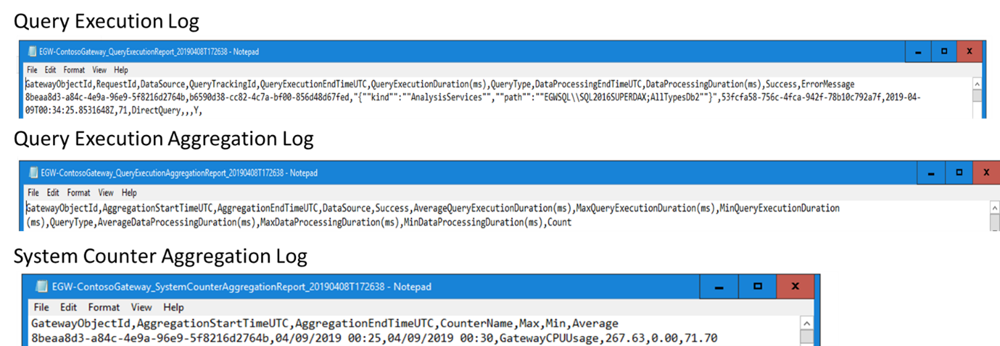

There are multiple sources for information on gateway performance monitoring. A key source is the Microsoft Docs repository. Another source is files that can be found on the gateway server. These files are the query execution log, query execution aggregation log, and system counter aggregation log.

> [!div class="mx-imgBorder"]
> 

By enabling these logs to monitor your gateway, you'll have a starting point if you're trying to determine the cause of unexpected performance or usage levels on your gateway.

There is also an out-of-the-box [Power BI template](https://download.microsoft.com/download/D/A/1/DA1FDDB8-6DA8-4F50-B4D0-18019591E182/GatewayPerformanceMonitoring.pbit) for visualization that you can download.