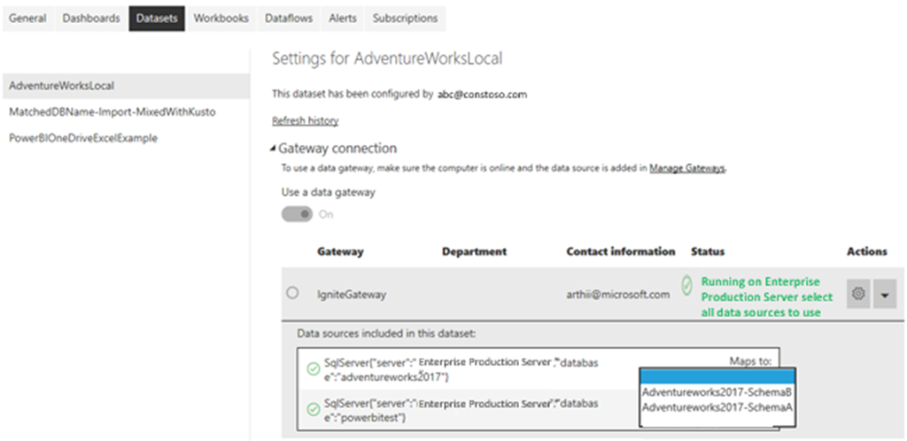

There are few limitations to the number of data sources you can connect with through your gateway. Furthermore, you can create multiple data source entries for the same data source, which allows you to manage which users can access specific data within the original data source. For example, if you have a large Excel data source containing company financial information, you can create a data source entry targeting confidential financial information and only allow access to authorized finance employees. Or create a data source entry to pull sales and marketing data and restrict access to only authorized marketing staff.

> [!div class="mx-imgBorder"]
> 

Through your Power BI dataset, you can select any available data source entry.

> [!div class="mx-imgBorder"]
> 