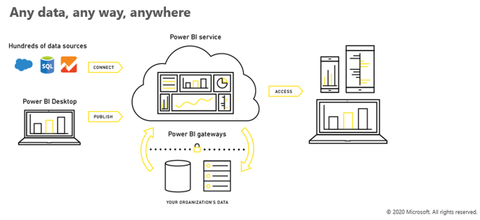

The explosion of data permeating all organizations is changing the way we interact with data and the way we seek to draw intelligence from this vast and often untapped potential. 

- It's estimated that in 2020 fifty zettabytes of data had been created - this is 20,000 times the total amount of data that existed in the world less than three decades ago.

- For most organizations, this data resides on-premise, or in the Microsoft or alternative cloud solutions. It may also reside in a hybrid environment where data is present in both the cloud and on-premise systems making it challenging to access and draw actionable insights from the data.

> [!div class="mx-imgBorder"]
> 

With Power BI, there's no need to move any data. As a business intelligence and analytics SaaS application, Power BI allows business users to access the data wherever it resides and gain actionable business insights.

Power BI allows users to:

- Harness data from Excel spreadsheets, on-premises data sources, big data, streaming data, and cloud services - it doesn't matter what type of data you want or where it lives, Power BI allows you to connect to hundreds of data sources.

- Take advantage of content packs that deliver a curated experience with pre-built dashboards for popular SaaS applications to get you up and running quickly.

- Experience their data with speed and agility:

- Use live dashboards that maintain a real-time pulse on the business and provide critical insights.

- Create custom visuals that bring data to life and surface intelligence hidden in the sea of data.

- Benefit from natural language queries that enable users to ask questions of their data in an intuitive way.

- Access data and insights anywhere with dashboards accessible via the desktop, web or across mobile devices.

Power BI also allows users to take advantage of world-class data analytics capabilities from historical data sets and delivers the ability to see your data as it's happening in real time, minimizing the need to analyze historical data.

- Transitioning from historical intelligence to actionable real-time insights is propelling modern business intelligence (BI) and accelerating the evolution of Power BI, allowing users to act where and when needed.

- Power BI seamlessly integrates with Microsoft business applications (apps) like Dynamics 365 and Office 365, arming users with insights directly within the Microsoft apps they use every day. And with Power BI Embedded, organizations also have the flexibility to infuse third-party apps with the same intelligence.

- Lastly, integrating intelligence at the point of action leads to automation within systems that trigger commands based on preset thresholds, further operationalizing business insight throughout an organization.
