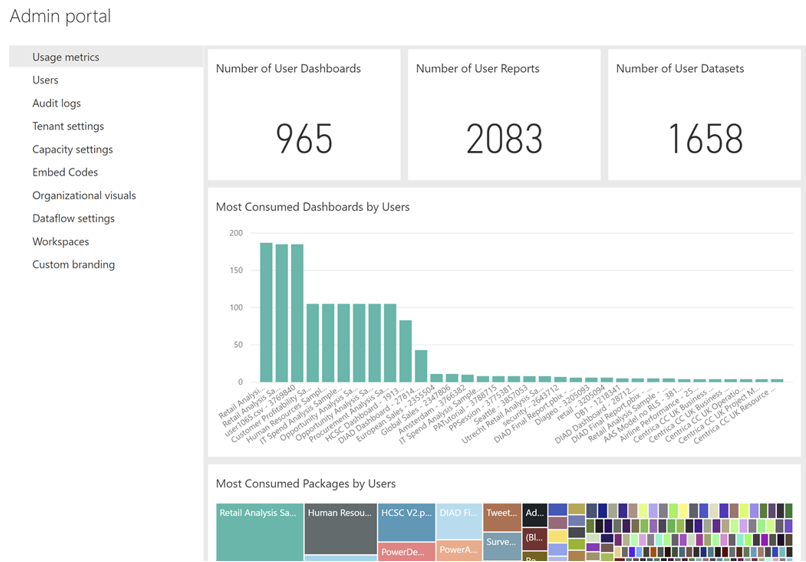

Usage metrics are available through the Power BI admin portal. This view provides a high-level record of what's going on in a tenant. Interestingly, it's sometimes more important to realize what's not happening in a tenant. For example, if a company has many Power BI Pro licenses that aren't used effectively, corrective action can then be taken. These reports tend not to be time bound, or time sensitive. They'll present what objects are being accessed by how many users. However, the report won't reflect the times during the day or reporting period when usage was highest.

New usage metrics are being regularly added to this report.

> [!div class="mx-imgBorder"]
> 

For additional information about Power BI usage metrics, review the [Usage Metrics section of this article](https://go.microsoft.com/fwlink/?linkid=2162218).
