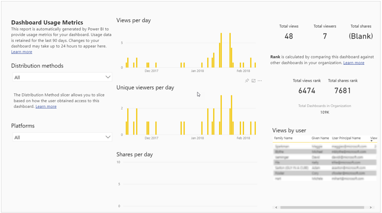

Usage metrics let you see the usage of individual dashboards and reports. Some of the metrics identify who the users are and how frequently the users are accessing the dashboard or report.

Following is an example of a dashboard usage metrics report.

> [!div class="mx-imgBorder"]
> 

Reported usage metrics may differ from audit log numbers because of the way in which different reporting systems collect the metrics.

> [!NOTE]
> Several screenshot examples shown in this module include personally identifiable information (PII.) An important privacy feature is that Admins can hide user details from usage metrics via tenant settings. For additional information regarding hiding user details, see [Exclude user information from usage metrics reports](https://go.microsoft.com/fwlink/?linkid=2162176&clcid=0x409).  

Usage metrics reports are read-only. However, you can personalize a usage metrics report by using "Save as." This creates a brand-new dataset and converts the read-only report to a full-featured Power BI report that can be edited. Not only does the personalized report contain metrics for the selected dashboard or report, removing the default filter allows access to usage metrics for all dashboards or all reports in the selected workspace. Using this practice also allows you to capture the names of your end users. Lastly, the admin settings that control who can access reports allow admins to reflect which users are shown by name. This may be important for compliance, as in some countries such as Germany, restrict by law the ability to show who is doing what as part of their job. For these cases Power BI gives the admin a way to prevent showing a group of users by name.

For additional information about usage metrics for dashboards and reports, view this [article](/power-bi/collaborate-share/service-usage-metrics/?azure-portal=true).
