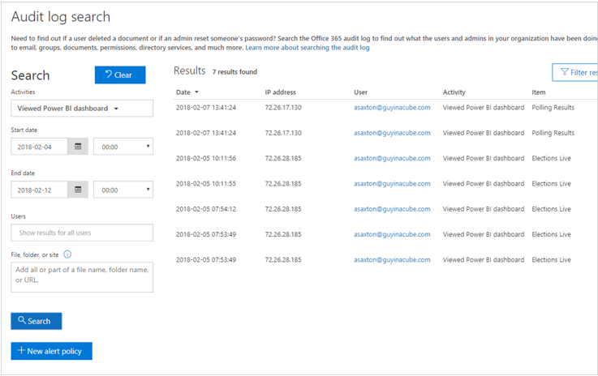

Knowing who is taking what action on which item in your Power BI tenant can be critical in helping your organization fulfill its requirements, like meeting regulatory compliance and records management. With Power BI, you have two options to track user activity: The [Power BI activity log](/power-bi/admin/service-admin-auditing#use-the-activity-log/?azure-portal=true) and the [unified audit log](/power-bi/admin/service-admin-auditing?azure-portal=true#use-the-audit-log). The Power BI activity log will be covered in Unit 5 of this course.

As the tenant admin, it's likely that at some point you'll be required to answer questions about a specific instance or activity in the tenant. Questions such as who is accessing my report, or when did they access the report will require investigation by the tenant admin. These investigations can be done through the O365 cloud. But these queries produce event activity records on all products in the O365 container, including:

- SharePoint Online
- Exchange Online
- Dynamics 365
- Other services
- Power BI auditing events

Access to audit logs is restricted to Microsoft 365 global administrators and require an Exchange Online license. You can use a PowerShell cmdlet to download the data for investigations and analysis, but the data is only retained for 90 days. A good practice may be to log regularly scheduled queries in a repository that can be reserved for access beyond the 90-day period.

The following is an example of an audit log search.

> [!div class="mx-imgBorder"]
> 

The Power BI audit log search is primarily a manual task. The Power BI activity log is the set of audit events specific to Power BI.

For additional information about Power BI audit logs, review [Track user activities in Power BI](/power-bi/admin/service-admin-auditing/?azure-portal=true).
