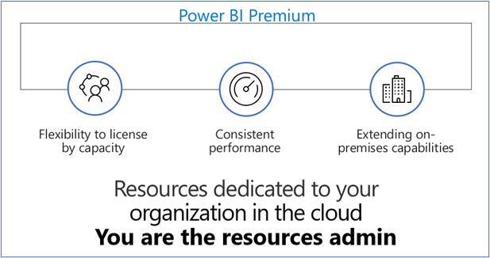

> [!div class="mx-imgBorder"]
> 

Power BI Premium provides resources that are dedicated to your organization in the cloud. Unlike with Power BI Pro, Power BI Premium is not managed by Microsoft. With Power BI Premium, you're the resource administrator (admin).

Power BI Premium gives an organization's users the following capabilities:

-   Greater scale and performance for Power BI reports

-   Licensing by capacity instead of by user

-   Best-in-class features for data visualization and insight-extraction such as AI-driven analysis, composable and reusable data flows, and paginated reports

-   Unified self-service and enterprise BI with various Premium-only capabilities that support heavier workloads and require enterprise scale

-   Built-in license to extend on-premises BI with Power BI Report Server

-   Support for data residency by region (Multi-Geo) and customer-managed encryption keys for data at rest with Bring Your Own Key (BYOK)

-   Ability to share Power BI content with anyone (even outside your organization) without purchasing a per-user license

## Power BI Pro versus Power BI Premium

Power BI Premium licensing refers to licensed capacity or content, whereas Pro licensing is related to individual users.

|     Power BI Pro                                            |     Power BI Premium                                                                                                                                                  |
|-------------------------------------------------------------|-----------------------------------------------------------------------------------------------------------------------------------------------------------------------|
|     Per-user license                                        |     Dedicated capacity   (think Virtual Machine)                                                                                                                      |
|     Gives access to   sharing and collaboration features    |     Read-only content   can be shared with non-Pro (free license) end users. A Pro license is needed   only if the user wants to publish content to the workspace.    |
|                                                             |     Support for much   larger data models (up to 10 GB)                                                                                                               |