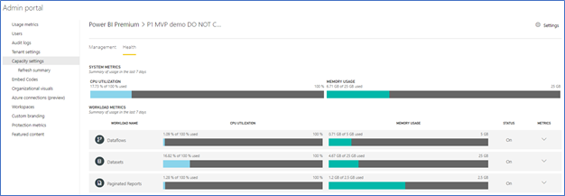
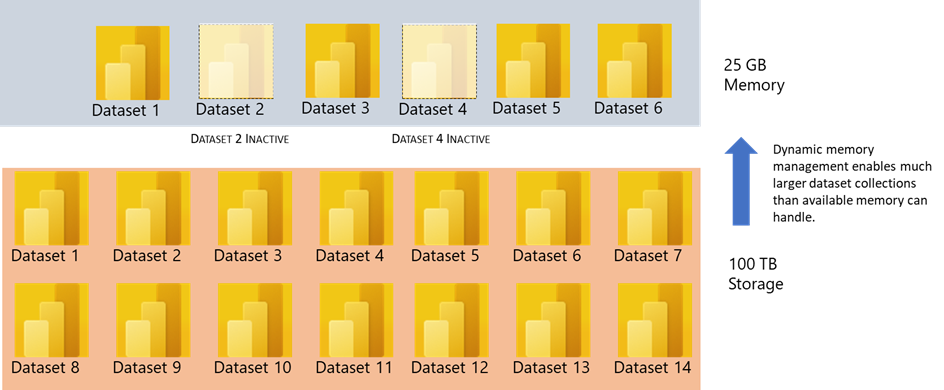
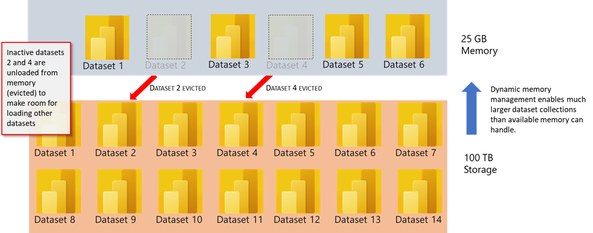
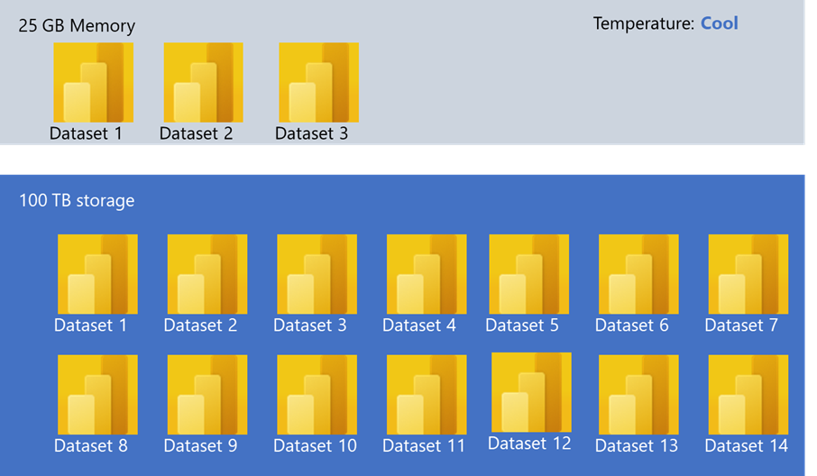
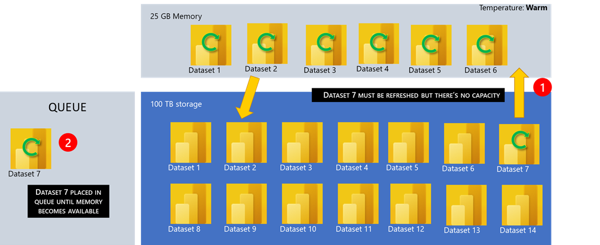
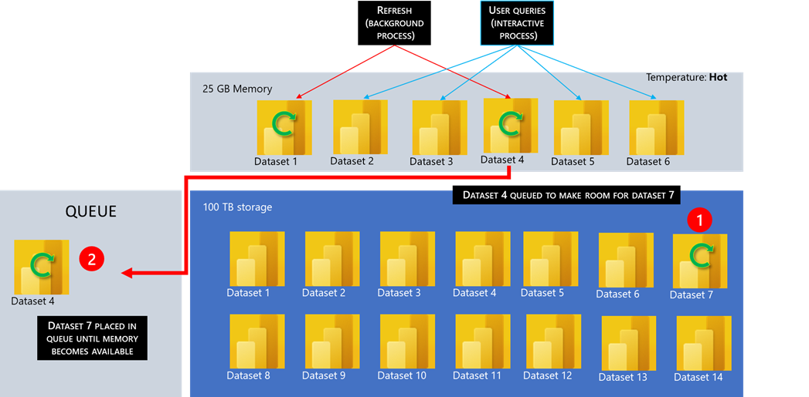
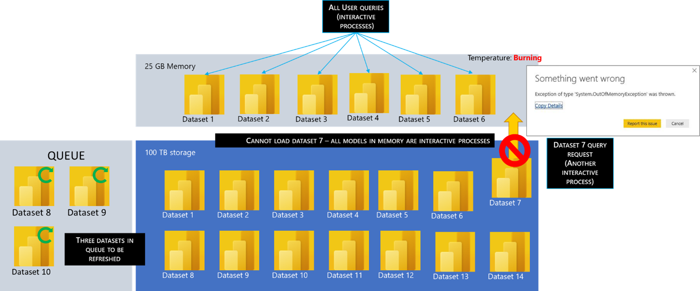

The Power BI Premium admin portal gives you insights into the usage of your Premium capacity.

The Health tab lets you view usage statistics for CPU and memory of your capacity and workloads usage over the previous seven days.

> [!div class="mx-imgBorder"]
> 

You can monitor capacities in the Admin portal or with the **Power BI Premium Capacity Metrics** app. To learn more about monitoring in the portal, see [Monitor Premium capacities](https://docs.microsoft.com/power-bi/admin/service-admin-premium-monitor-portal/?azure-portal=true) in the Admin portal.

## Premium resource management eviction

**Eviction** is a normal process within Power BI where datasets that are not in use are removed from memory so that new datasets can be loaded for queries or refreshes.

Power BI uses dynamic memory management to evict inactive datasets from memory. Dynamic memory management allows the sum of dataset sizes to be greater than the memory available on the capacity, but a single dataset must fit into memory. For more info on dynamic memory management, see [How capacities function](https://docs.microsoft.com/power-bi/admin/service-premium-what-is?azure-portal=true#how-capacities-function).

## Dataset eviction example

> [!div class="mx-imgBorder"]
> 

In the example above, datasets one through six are loaded into memory. However, datasets 2 and 4 are no longer in use - for example, they are no longer being queried.

> [!div class="mx-imgBorder"]
> 

It's important to stress that dataset eviction is a normal behavior on the capacity. The capacity strives to balance memory usage by managing the in-memory lifecycle of models in a way that is transparent to users. A high eviction rate does not necessarily mean the capacity is insufficiently resourced. It can, however, become a concern if the performance of queries or refreshes degrades due to the overhead of loading and evicting models repeatedly within a short span of time.

You should consider the impact of eviction on large models. Despite relatively fast dataset load times, there could still be a noticeable delay for users if they must wait for large evicted datasets to be reloaded.

For this reason, in its current form, the large models feature is recommended primarily for capacities dedicated to enterprise BI requirements rather than capacities mixed with self-service BI requirements. Capacities dedicated to enterprise BI requirements are less likely to frequently trigger eviction and need to reload datasets. Capacities for self-service BI on the other hand can have many small datasets that are more frequently loaded in and out of memory.

## What resources does Power BI consume?

For the following sections, we will use a P1 capacity for all our use case scenarios:

|     Resource            |     Level     |
|-------------------------|---------------|
|     Capacity:           |     P1        |
|     Backend v-cores:    |     4         |
|     Memory:             |     25 GB     |
|     Storage:            |     100 TB    |

The 25 gigabytes are for active memory, which holds any datasets currently in use. The 100 terabytes are the amount of storage available for all datasets in all the workspaces combined.

> [!div class="mx-imgBorder"]
> 

In the example above, three datasets out of 14 total are currently in memory. All three of the active datasets are being queried by end users, so they are active. The remainder is in storage. We have sufficient memory, so the temperature of the capacity is cool right now. Everything is good, the users are happy and response times are good.

## What happens when capacity is out of resources?

Models must be fully loaded into memory so they can be queried or refreshed. The Power BI service uses sophisticated algorithms to manage memory usage fairly, but in rare cases, the capacity can get overloaded if there are insufficient resources to meet customers' real-time demands.

While it's possible for a capacity to store many models in persistent storage (up to 100 TB per Premium capacity), not all the models necessarily reside in memory at the same time; otherwise, their in-memory dataset size can easily exceed the capacity memory limit. Besides the memory required to load the datasets, other memory is needed for execution of queries and refresh operations.

Models are therefore loaded and removed from memory according to usage. A model is loaded when it is queried (interactive operation), or if it needs to be refreshed (background operation).

> [!div class="mx-imgBorder"]
> 

In the example above:

-   The memory resources are already at capacity, but Dataset 7 needs to be loaded (1).

-   Datasets two and four are inactive, so the service will select an inactive dataset that is greater than or equal to Dataset seven and evict it from memory. In this example, Dataset two is selected for eviction (2).

-   Dataset seven is then loaded into memory.

## How many datasets can I refresh at one time?

Refreshes, like queries, require the dataset to be loaded into memory. If there is insufficient memory, the Power BI service will attempt to evict inactive models, and if this isn't possible (if all models are active), the refresh job is queued.

Refreshes are typically CPU-intensive, even more so than queries. For this reason, a limit on the number of concurrent refreshes, calculated as the ceiling of 1.5 x the number of backend v-cores, is imposed. So, for a P1 capacity with four v-cores, only six datasets can be refreshed at one time.

If there are too many concurrent refreshes, the scheduled refresh is queued until a refresh slot is available, resulting in the operation taking longer to complete. On-demand refreshes such as those triggered by a user request or an API call will retry three times. If there still aren't enough resources, the refresh will then fail.

> [!div class="mx-imgBorder"]
> 

In the example above:

-   This is a P1 capacity, which can support up to six simultaneous dataset refreshes.

-   Dataset 7 also must be refreshed, but there is currently no capacity since six datasets are currently being refreshed (1).

-   Dataset 7 is queued for refresh once sufficient memory resources are available (2).

## Interactive versus background capacity operations

Capacity operations are classified as either *interactive* or *background*.

-   Interactive operations include rendering requests and responding to user interactions (for example, filtering, Q&A querying, and so on.).

-   Background operations include dataflow and dataset refreshes, and dashboard query caching.

It's important to understand that interactive operations are always prioritized over background operations to ensure the best possible user experience.

If there are insufficient resources, background operations are added to a waiting queue until resources free up. Background operations, like dataset refreshes, can be interrupted mid-process by the Power BI service, added to a queue, and retried later.

> [!div class="mx-imgBorder"]
> 

In the example above:

-   In this scenario, dataset 1 and dataset 4 are background processes and the other ones are interactive and being used by end users.

-   Dataset 7 must also be refreshed but there are no memory resources available (1).

-   In order to load dataset 7, the service selects a background operation, which will free up enough memory. Room is made by moving one of the background processes into the queue (in this example, dataset 4) and moving dataset 7 into the memory so it can be queried (2).

-   At this time the temperature will be hot because one refreshed dataset will be moved into the queue and later when there's room, it will be moved back into memory again.

## What if all processes in memory are interactive?

> [!div class="mx-imgBorder"]
> 

In the example above:

-   Datasets 1 through 6 are all being queried actively by end users.

-   There are already three datasets in the queue that want to be refreshed when there is memory available.

-   Dataset 7 is also queried, but there's not enough memory to load the dataset.

-   The datasets that are already in memory are interactive, so there's not a dataset that can be evicted, because then end users will also get an error that memory is overloaded.

-   Dataset 7 also cannot be loaded because the other datasets are already in memory.

-   End users that are querying dataset 7 will get an out-of-memory exception in the report.

## Dedicated Capacity SKUs and dataset refresh support

The table below shows each Power BI Premium SKU, the number of v-cores, and their associated simultaneous dataset refresh capacity. Remember, simultaneous refresh capacity is 1.5 x number of v-cores.

|     Name                                    |     Virtual Cores    |     Memory          |     Dataset   Refresh Capacity    |
|---------------------------------------------|----------------------|---------------------|-----------------------------------|
|     Power BI Embedded A1 / Premium EM1      |     1                |     3-GB RAM        |     1                             |
|     Power   BI Embedded A2 / Premium EM2    |     2                |     5-GB RAM      |     2                             |
|     Power BI Embedded A3 / Premium EM3      |     4                |     10-GB RAM       |     3                             |
|     Power   BI Embedded A4 / Premium P1     |     8                |     25-GB RAM     |     6                             |
|     Power BI Embedded A5 / Premium P2       |     16               |     50-GB RAM       |     12                            |
|     Power   BI Embedded A6 / Premium P3     |     32               |     100-GB RAM    |     24                            |

## Factors to consider for performance and capacity management

You should consider the following factors that can affect performance and capacity management when you plan your Power BI Premium implementation.

-   Dataset size and data characteristics

-   How many different datasets will be used in parallel

-   How many refresh in parallel

-   How frequent datasets are refreshed

-   How many visuals are on a page

-   How often users are interacting with visuals

-   How efficient are the measures in the dataset

## Testing premium capacity

A tool is available that lets you test scenarios that would be typical for your users so that you can plan your Power BI Premium capacity and how it handles workloads. When testing, consider the following factors:

-   Set up realistic, controlled workload tests

-   Test should be repeatable (run several times)

-   Find a realistic scenario (include think time)

-   If the testing indicates a single SKU cannot handle the workloads, consider scaling out with another SKU

For more information and links to the load testing tool, [visit this link](https://powerbi.microsoft.com/blog/power-bi-premium-know-what-your-premium-capacity-can-handle/?azure-portal=true). For more information about troubleshooting and optimizing Power BI Premium capacities, [visit this link](https://docs.microsoft.com/power-bi/admin/service-premium-capacity-optimize/?azure-portal=true).

