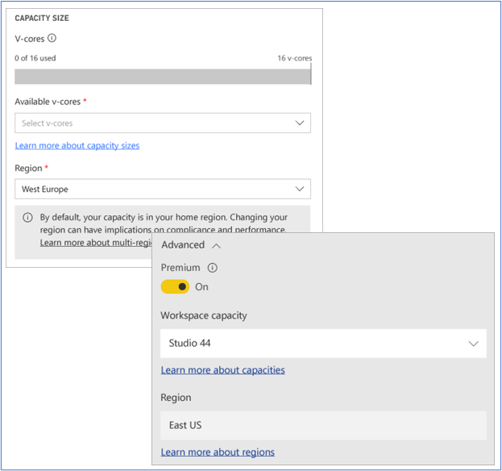

Multi-Geo is a Power BI Premium feature that helps multinational customers address regional, industry-specific, or organizational data residency requirements. This capability enables you to deploy content to datacenters in regions other than the home region of the Power BI tenant.

The example shown below illustrates two capacities that are distributed between West Europe and East US regions.

> [!div class="mx-imgBorder"]
> 

You can choose to deploy content to any of the following geographies (geos) defined in the [Azure geography map](https://azure.microsoft.com/global-infrastructure/geographies/?azure-portal=true).
