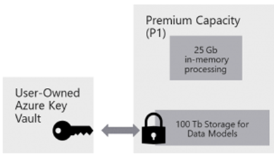

Organizations requiring more controls over how their data is encrypted can exercise that control by configuring Power BI to use their own keys, stored in Azure Key Vaults, for data-at-rest encryption instead of Microsoft-managed keys.

> [!div class="mx-imgBorder"]
> 

Power BI encrypts data *at-rest* and *in process*. By default, Power BI uses Microsoft-managed keys to encrypt your data. With Power BI Premium, you can also use your own keys for data at-rest that is imported into a dataset. This approach is often described as *bring your own key* (BYOK).

BYOK makes it easier to meet compliance requirements that specify key arrangements with the cloud service provider (in this case Microsoft). With BYOK, you provide and control the encryption keys for your Power BI data at-rest at the application level. As a result, you can exercise control and revoke your organization\'s keys, should you decide to exit the service. By revoking the keys, the data is unreadable to the service within 30 minutes.

## Data source and storage considerations

To use BYOK, you must upload data to the Power BI service from a Power BI Desktop (PBIX) file. You cannot use BYOK in the following scenarios:

-   Analysis Services Live Connection

-   Excel workbooks (unless data is first imported into Power BI Desktop) Push datasets

-   Streaming datasets

