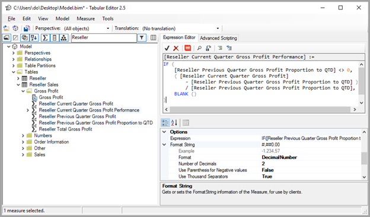
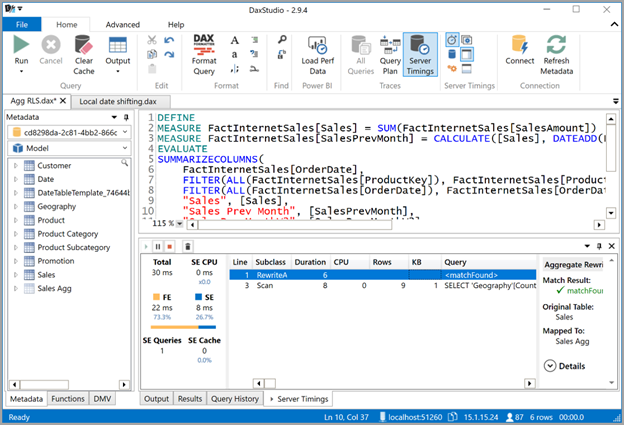
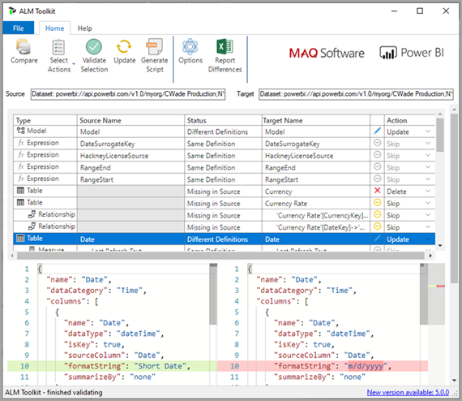

There are many external tools available for use with Power BI Premium, but three are featured here.

## Tabular Editor

> [!NOTE]
> This tool can be used with any other Power BI capacity as well.

> [!div class="mx-imgBorder"]
> 

Tabular Editor is an open-source tool for creating, maintaining, and managing tabular models using an intuitive, lightweight editor. You can use this as an alternative to SQL Server Data Tools (SSDT) for all tabular models for analysis services, and it can be used without the workspace server. It provides a hierarchical view shows all objects in your tabular model. Objects are organized by display folders with support for multi-select property editing and DAX syntax highlighting. XMLA read-only is required for query operations. Read-write is required for metadata operations. To learn more, view [tabulareditor.github.io](https://tabulareditor.github.io/?azure-portal=true).

## DAX Studio

> [!NOTE]
> This tool can be used with any other Power BI capacity as well.

> [!div class="mx-imgBorder"]
> 

DAX Studio is an open-source tool for DAX authoring, diagnosis, performance tuning, and analysis. Features include object browsing, integrated tracing, query execution breakdowns with detailed statistics, DAX syntax highlighting and formatting. XMLA read-only is required for query operations. To learn more, view [daxstudio.org](https://daxstudio.org/?azure-portal=true).

## ALM Toolkit

> [!NOTE]
> This tool is specific to Power BI Premium only.

> [!div class="mx-imgBorder"]
> 

ALM Toolkit is an open-source schema compare tool for Power BI datasets, most often used for application lifecycle management (ALM) scenarios. Perform deployment across environments and retain incremental refresh historical data. Diff and merge metadata files, branches, and repos. Reuse common definitions between datasets. Read-only is required for query operations. Read-write is required for metadata operations. To learn more, see [alm-toolkit.com](http://alm-toolkit.com/?azure-portal=true).