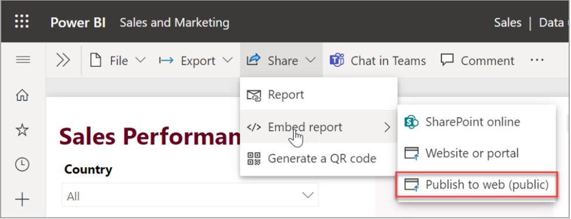
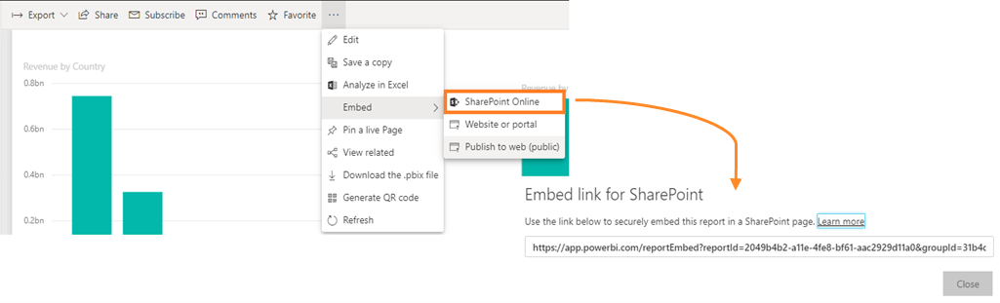
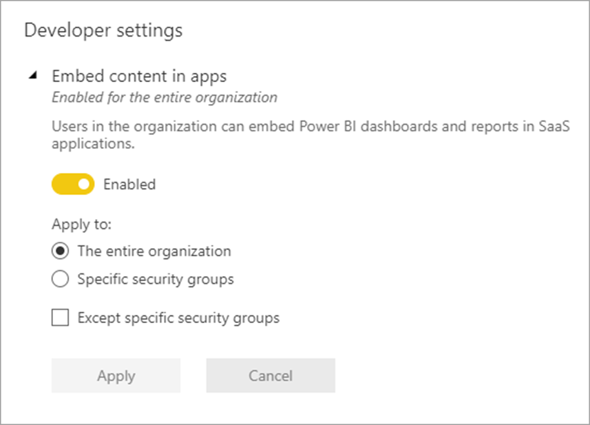

There are various ways to share your Power BI reports beyond your tenant. The following is a list of embedding scenarios you may elect to use. We will examine each option through the remainder this module.

-   Publish to web

-   Embed in Microsoft Teams

-   SharePoint Online web part

-   Embed in PowerApps

There is also a special version of Power BI that can be initiated through the Azure portal called Power BI Embedded (PBIE). PBIE allows application developers to embed fully interactive reports into their applications. Microsoft developed Power BI Embedded for independent software vendors (ISVs) wanting to embed visuals into their applications to help their customers make analytic decisions and spares ISVs from having to build their own analytics' solutions. 

For more information about PBIE, see this [article](https://docs.microsoft.com/power-bi/developer/embedded/embedded-faq/?azure-portal=true).

## Publish to web

With the Power BI Publish to web option, you can easily embed interactive Power BI content in blog posts, websites, emails, or social media. You can also easily edit, update, refresh, or stop sharing your published visuals.

> [!NOTE]
> Publish to web is disabled by default. Power BI admins can enable this feature in the Admin portal > tenant settings > export and sharing settings.

> [!WARNING]
> Proceed with caution. When you use Publish to web, anyone on the Internet can view your published report or visual. Viewing requires no authentication. These factors of Publish to web make it an excellent option for publishing public relations material. It includes viewing detail-level data that your reports aggregate. Before publishing a report, make sure it's okay for you to share the data and visualizations publicly. Don't publish confidential or proprietary information. If in doubt, check your organization's policies before publishing.

Access the publish to web option through the Power BI admin portal.

> [!div class="mx-imgBorder"]
> 

For more information on the publish to web option, see this [article](https://docs.microsoft.com/power-bi/collaborate-share/service-publish-to-web/?azure-portal=true).

## Embed in Microsoft Teams

You can embed Power BI reports in Microsoft Teams. In your Microsoft Teams channel, select the + sign and choose the Power BI option as a tab. Microsoft Teams automatically detects all the reports in your Power BI groups and in My Workspace. You can choose which reports you want to show in your Power BI tab in your channel.

> [!div class="mx-imgBorder"]
> 

## SharePoint Online web part

With the new Power BI report web part for SharePoint Online, you can easily embed interactive Power BI reports in SharePoint Online pages.

When using the new **Embed in SharePoint Online** option, the embedded reports respect all item permissions and data security through [row-level security (RLS)](https://docs.microsoft.com/power-bi/admin/service-admin-rls/?azure-portal=true), so you can easily create secure internal portals.

> [!div class="mx-imgBorder"]
>  

Embedding a report in SharePoint Online requires no coding knowledge, does not work with on-premises SharePoint and requires the user to log into SharePoint to access reports.

For more information regarding embedding reports in a SharePoint Online web part, see this [article](https://docs.microsoft.com/power-bi/collaborate-share/service-embed-report-spo/?azure-portal=true).

## Embed in PowerApps

To embed dashboards and reports in PowerApps, the embed content in apps under developer settings on the portal must be enabled. In this setting, you will also select which users can embed content in apps. You have the option to enable the entire organization or restrict the capability to specific security groups.

> [!div class="mx-imgBorder"]
> 

