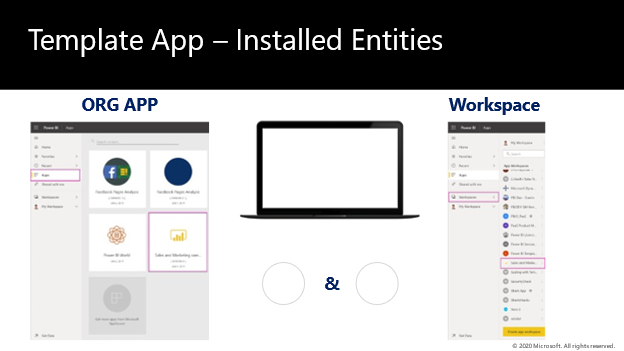

The primary governance role regarding template apps is to determine who can install first- and third-party applications from both AppSource and Direct links.

By default AppSource installation settings are set to on in the Admin portal, and direct links settings by default are set to off.

The last key governance task entails controlling who can publish template apps outside of the organization. This setting in the admin portal is set to off by default.

> [!div class="mx-imgBorder"]
> 
