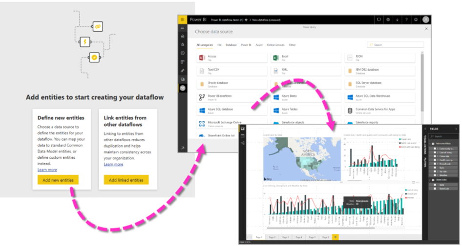

A **dataflow** is a collection of tables that are created and managed in workspaces in the Power BI service. A **table** is a set of columns that are used to store data, much like a table within a database. You can add and edit tables in your dataflow, and manage data refresh schedules, directly from the workspace in which your dataflow was created.

Dataflows are designed to support the following scenarios:

-   Create reusable transformation logic that can be shared by many datasets and reports inside Power BI. Dataflows promote reusability of the underlying data elements, preventing the need to create separate connections with your cloud or on-premises data sources.

-   Expose the data in your own Azure Data Lake Gen 2 storage, enabling you to connect other Azure services to the raw underlying data.

-   Create a single source of the truth by forcing analysts to connect to the dataflows, rather than connecting to the underlying systems, providing you with control over which data is accessed, and how data is exposed to report creators. You can also map the data to industry standard definitions, enabling you to create tidy curated views, which can work with other services and products in Microsoft Power Platform.

-   If you want to work with large data volumes and perform ETL at scale, dataflows with Power BI Premium scales more efficiently and gives you more flexibility. Dataflows supports a wide range of cloud and on-premises sources.

-   Prevent analysts from having direct access to the underlying data source. Since report creators can build on top of dataflows, it may be more convenient for you to allow access to underlying data sources only to a few individuals, and then provide access to the dataflows for analysts to build on top of. This approach reduces the load to the underlying systems and gives administrators finer control of when the systems get loaded from refreshes.

Once you've created a dataflow, you can use Power BI Desktop and the Power BI service to create datasets, reports, dashboards, and apps that use the Common Data Model to drive deep insights into your business activities. Dataflow refresh scheduling is managed directly from the workspace in which your dataflow was created, just like your datasets.

To create a dataflow, launch the Power BI service in a browser then select a **workspace** (dataflows are not available in *my-workspace* in the Power BI service) from the navigation pane on the left, as shown in the following screen. You can also create a new workspace in which to create your new dataflow.

> [!div class="mx-imgBorder"]
> 

The next two steps are to schedule a refresh and build the dataset using your Power BI desktop.

For more information or instructions on how to create a dataflow, see the following [article](https://docs.microsoft.com/power-bi/transform-model/dataflows/dataflows-create/?azure-portal=true).

