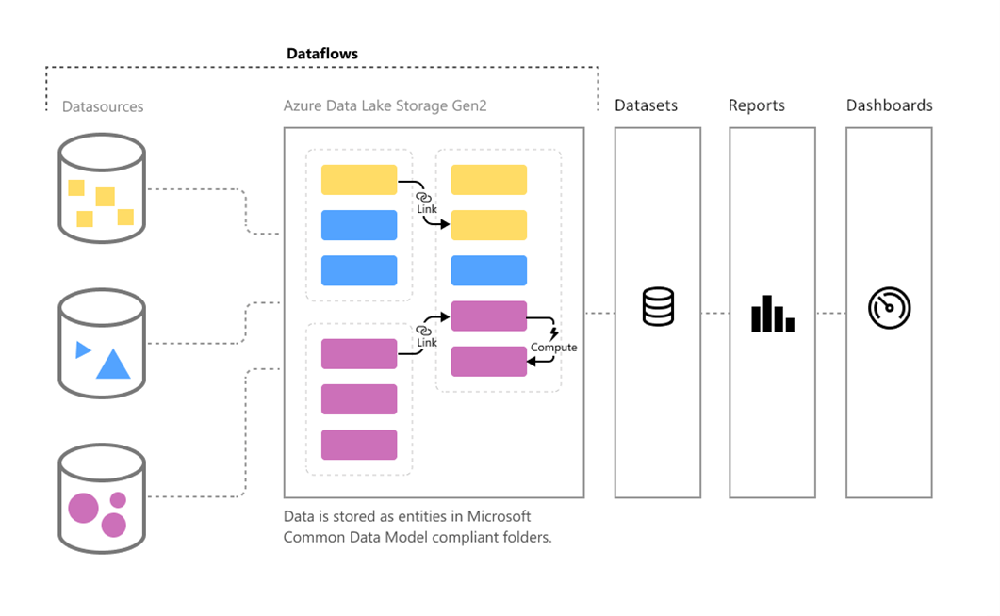

Dataflows are created and managed in workspaces by using the Power BI service. Data is stored as entities in the Common Data Model in Azure Data Lake Storage Gen2.

> [!div class="mx-imgBorder"]
> 

With dataflows, you can ingest data from both on-premises or cloud data sources, and you have the ability map, edit, and extend standard entities. You can also create custom entities and to create Power BI datasets using a dataflow. Lastly, it's required that a dataflow is refreshed before it can be consumed in a dataset inside Power BI desktop or referenced as a linked or computed table.

For more information on configuring and consuming dataflows, see this [article](https://docs.microsoft.com/power-bi/transform-model/dataflows/dataflows-configure-consume/?azure-portal=true).
