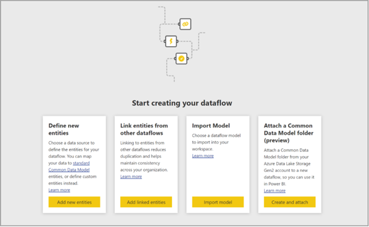

To create a dataflow, launch the Power BI service in a browser then select a workspace (dataflows are not available in *my-workspace* in the Power BI service) from the navigation pane on the left. You can also create a new workspace in which to create your new dataflow.

There are multiple ways to create or build on top of a new dataflow:

-   Create a dataflow using define new tables - Using the Define new tables option allows you to define a new table and connect to a new data source.

-   Create a dataflow using linked tables - Creating a dataflow using linked tables enables you to reference an existing table, defined in another dataflow, in a read-only fashion.

-   Create a dataflow using import/export - Creating a dataflow using import/export lets you import a dataflow from a file. This is useful if you want to save a dataflow copy offline or move a dataflow from one workspace to another.

-   Create a dataflow by attaching a common data model folder - Creating a dataflow from a CDM folder allows you to reference a table that has been written by another application in the Common Data Model (CDM) format. Using this method has several requirements including:

    -   Creator must possess the storage blob data owner role of the storage account.

    -   Creator must have read access and execute access control lists (ACLs) on both the CDM and any files or folders within it.

> [!div class="mx-imgBorder"]
> 
