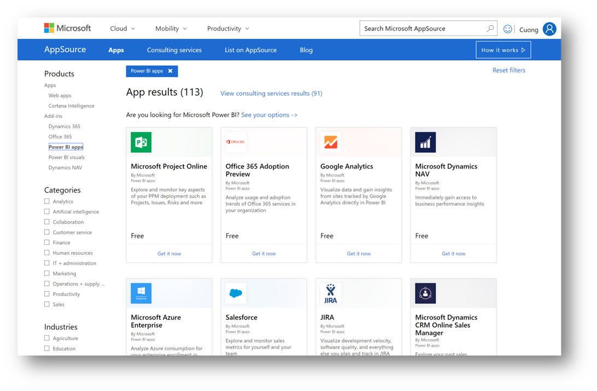

The new Power BI *template apps* enable Power BI partners to build Power BI apps with little or no coding and deploy them to any Power BI customer. Power BI Template Apps allow Power BI Pro or Power BI Premium users to gain immediate insights through prepackaged dashboards and reports that can be connected to live data sources. 

Many Power BI Apps are already available in the [Power BI Apps marketplace](https://app.powerbi.com/groups/me/getapps/apps/?azure-portal=true).

> [!div class="mx-imgBorder"]
> 

In addition to providing insights for your organization, there are many apps that have been published for usage monitoring.

There are other aspects associated with template apps that should be noted. For example:

-   In the pro user experience, you can customize everything. Once an app is installed in your tenant, it is similar to any other content you have in Power BI.

-   You will get continuous updates to content and you can either install side by side or overwrite it.

-   Administrators have authority to define who in the organization can install apps.
