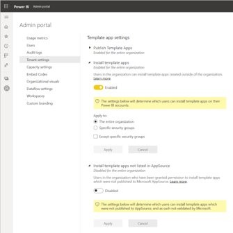

When using a template app, the app will be transferred to your Power BI tenant and you can use it like any other report or Power BI entity. Plus, if there is a newer version of an app you're using, you'll get a notification. You can either install the new version side by side or you can overwrite the previous one.

Every time you install another version of an app you will be getting more workspace.

> [!div class="mx-imgBorder"]
> 
