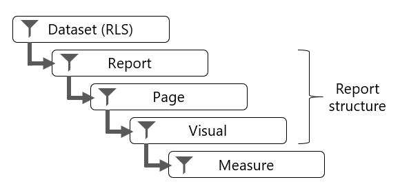

Filtering can occur at five different levels of a Microsoft Power BI report:

-   Dataset (RLS)

-   Report

-   Page

-   Visual

-   Measure

Report, page, and visual level filters apply to the structure of the report.

> [!div class="mx-imgBorder"]
> 

## Dataset (RLS)

Every Power BI report queries a single dataset, which is a Power BI artifact that represents a data model. The data model can enforce row-level security (RLS) to restrict access to a subset of data, and different users will see different data. A report can't determine whether the data model will enforce RLS, and it can't override RLS.

> [!IMPORTANT]
> When you filter RLS-filtered tables, take care to avoid situations where some report consumers see no data (BLANK) in the report. For example, consider a model that enforces RLS to restrict data visibility to specific countries. If at design time, you have permission to see Australian data and you filter the report by Australia, a report consumer that has permission to see only United States data won't see data at all.

For more information, see [Row-level security (RLS) with Power BI](/power-bi/admin/service-admin-rls/?azure-portal=true).

## Report structure

The structure of a Power BI report is hierarchical. The top level is the report, the second level comprises its pages, while the third level comprises report objects, which consist of visuals and elements. In the **Filters** pane, you can add a filter to any of these levels.

> [!NOTE]
> Filtering the report structure is covered in Unit 2. Filtering visuals with slicers is covered in Unit 3.

## Measure

A measure is a model object that is designed to summarize data. Measure formulas, which are written in Data Analysis Expressions (DAX), can modify filter context by using the CALCULATE or CALCULATETABLE functions. These functions are powerful and provide you with the flexibility to add, remove, or modify filters. A set of DAX functions, known as time intelligence functions, also modify filter context. These functions can override any filters that are applied to the report structure.

For more information, see the related links at the end of this module.

At report design time in Microsoft Power BI Desktop, you can create measures (except when the model is a live connection to SQL Server Analysis Services multidimensional model). These measures belong to the report, and so they're called *report-level measures*.

A good example of a measure that overrides report filters is a three-month moving average calculation. To compute the result for March, the filter context for month must expand to encompass January, February, and March. The CALCULATE function or a time intelligence function can modify the filter context to produce that result.

To gain a better understanding of report filtering, watch the following video that describes filter techniques at design time and consumption time.

> [!VIDEO https://www.microsoft.com/videoplayer/embed/RWObCg]