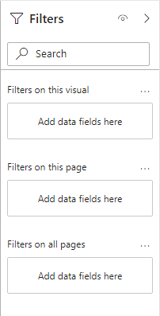
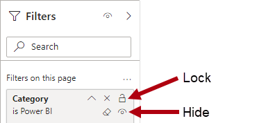
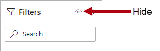

At report design time, use the **Filters** pane to apply filters to the report structure.

> [!div class="mx-imgBorder"]
> 

The **Filters** pane has three sections:

-   Filters on all pages

-   Filters on this page

-   Filters on this visual

The **Filters on all pages** section defines *report-level filters*, which apply to all report pages and visuals. Report-level filters are global filters.

The **Filters on this page** section defines *page-level filters*, which apply to all visuals on a specific page, adding to any existing report-level filters. For example, if a report-level filter restricts data to the country of United States, and a page-level filter restricts data to the state of Washington, then both filters are in effect: Country is United States and State-Province is Washington.

The **Filters on this visual** section defines *visual-level filters*. This section is only visible when one visual is in focus because visual-level filters apply only to a single visual; they add to any existing report-level and page-level filters. Extending the previous example, if a visual-level filter restricts data to the city of Seattle, then three filters are in effect: Country is United States, State-Province is Washington, and City is Seattle.

Unlike report and page-level filters, a visual-level filter can filter by using a measure. When a measure filters a visual, it's used to eliminate groups. For example, consider a column chart visual that groups by store. A measure filter could eliminate groups (stores) where the total store sales are less than a certain amount.

Filters apply to a single field and use one of following filter types:

-   Basic

-   Advanced

-   Top N

-   Relative date and Relative time

The **Basic filter** type allows you to select items from a list of distinct values that are found in the field. You can also restrict the filter to a single selection instead of multi-selection.

The **Advanced** filter type allows you to create more complex conditions by using data type-specific operators:

-   **Text field operators** - Test for conditions such as "contains," "starts with," "is blank," "is empty," and others.

-   **Numeric field operators** - Test for conditions such as "is less than," "is less than or equal to," and others.

-   **Date field operators** - Test for conditions such as "is after," "is on or after," and others.

You can combine multiple tests by using a logical AND/OR operator.

The **Top N** filter type applies to text and date fields that are available only in visual-level filters. This filter type helps you filter by the top (or bottom) number of items, like the top five products by revenue. To configure the filter, you must pass in a field that's summarized, like sales revenue.

The **Relative date** and **Relative time** filter types apply to date fields only, making it possible to filter by *relative date or time*. Relative filters allow the report consumer to filter by past, present, or future time periods based on the current date and time.

> [!TIP]
> If an overwhelming number of filters are available, use the search box to quickly narrow down the number of filters. You can also sort the filters alphabetically within each section in ascending or descending order. Also, to determine the model field for each filter, hover the cursor over a filter card to reveal the full reference to the model in terms of its table and the field name.

You can lock filters to ensure that report consumers can't remove or modify them. It's a good idea to lock filters that are critical to the design of the report, page, or visual. Additionally, you can hide filters. A hidden filter isn't visible to report consumers. Consider hiding a filter when the report consumer doesn't need to know about it, such as when filters are cleaning up the data, perhaps by removing BLANKs.

> [!div class="mx-imgBorder"]
> 

You can hide the entire **Filters** pane to ensure that report consumers can't open it.

> [!div class="mx-imgBorder"]
> 

For more information, see [Format filters in Power BI reports](/power-bi/create-reports/power-bi-report-filter/?azure-portal=true).
