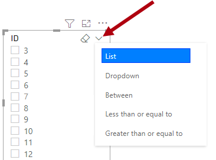

The [slicer](/power-bi/visuals/power-bi-visualization-slicers/?azure-portal=true) is a core visual with one purpose: to filter other visuals. It's one of the most common visuals that you add to a report page because it presents an intuitive way for report consumers to filter data. As a report author, you have considerable control over how the visual is laid out and formatted and how it functions.

By default, slicers filter all other visuals on the page. However, you can edit visual interactions to restrict filtering between two visuals. (Visual interactions are covered in more detail in Unit 4.) Sync slicers can also filter visuals on other pages.

For more information, see [Visual interactions in Power BI visuals](/power-bi/developer/visuals/visuals-interactions/?azure-portal=true).

For more information, see [Sync slicers across pages in Power BI reports](/power-bi/developer/visuals/enable-sync-slicers/?azure-portal=true).

> [!IMPORTANT]
> It might be tempting to think that slicers apply page-level filters because that's the default result. However, it's important to understand that a slicer is a visual that propagates filters to other visuals on the same page or (when synced) across other pages.

You can configure a slicer by using one or more fields from the same table or a hierarchy. When configured to use multiple fields or a hierarchy, the slicer presents an expandable tree structure of items.

The slicer layout is responsive to the data type of the field. Field data types are either text, numeric, or date. By default, a text field will produce a list slicer, a numeric field will produce a numeric range "between" filter, and a date field will produce a date range "between" filter, allowing value selection with calendar controls.

At design time, you can modify the slicer layout so that lists become dropdown lists. Dropdown lists use much less space on the report page. Numeric and date ranges offer additional layouts, allowing you to select a single value that acts as the lower or upper boundary of the filter. The reason why numeric and date slicers have additional layouts is because these data types represent continuous values. Therefore, the slicer layouts allow filtering by ranges of continuous values.

> [!NOTE]
> To change the slicer layout, hover the cursor over the slicer to reveal a down arrow that's located in the upper-right corner. Select the arrow to reveal a context menu of layout options.

> [!div class="mx-imgBorder"]
> 

A slicer that is based on a date field offers additional layouts to filter by *relative date or time*. Relative filters allow the report consumer to filter by past, present, or future time periods based on the current date and time. For example, a relative date slicer could filter by the current date (today).

Possible layouts for the field data type are:

-   **Text field -** List (default) or dropdown

-   **Numeric field -** List, dropdown, between (default), less than or equal to, or greater than or equal to

-   **Date field -** List, dropdown, between (default), before, after, relative date, or relative time

> [!TIP]
> Dropdown slicer layouts are common; they help minimize the size of the slicer to provide more room on the page for other visuals. An additional benefit when using dropdown slicers that might not be immediately apparent is that they only query the dataset when expanded open. Therefore, they can also help expedite report page rendering.

List and dropdown slicers support format options to control the selection of items. When you enable the **Single select** option, the slicer allows only a single item selection. That approach makes sense for a slicer like scenario, where the options are Actual, Budget, or Forecast. In this case, it only makes sense to filter by one scenario at a time.

Other configuration options are available for you to modify slicer behavior and its look. To learn more, watch the following video that demonstrates how to configure and style slicers.

> [!VIDEO https://www.microsoft.com/videoplayer/embed/]
