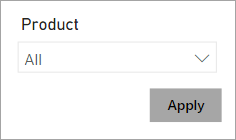

Beyond filters and slicers, report authors can employ other filtering techniques, such as:

-   Visual interactions

-   Drillthrough

-   Report tooltip

-   Bookmarks

-   Report options

-   Query reduction options

## Visual interactions

By default, when report consumers interact with visuals, filters are propagated to other visuals on the report page. This way, visuals behave like slicers. For example, a report consumer can select a column of a column chart visual to filter other visuals on the page. To remove the cross filters, they can either select the column again or select a different visual.

> [!TIP]
> While cross filtering, you can introduce additional cross filters, even from other visuals, by pressing the **Ctrl** key.

Cross filtering (and cross highlighting) works between any two visuals. However, at design time, you can edit visual interactions between any pair of visuals and in either direction. Additionally, you can disable cross filtering or modify the interaction to use cross highlighting instead.

To gain a better understanding of visual interactions, watch the following video that describes a use case and shows how to configure it.

> [!VIDEO https://www.microsoft.com/en-us/videoplayer/embed/RWO1bN]

For more information, see [Filters and highlighting in Power BI reports](/power-bi/create-reports/power-bi-reports-filters-and-highlighting/?azure-portal=true).

## Drillthrough

Add drillthrough pages to allow report consumers to drill from visuals. By default, the drillthrough action propagates all filters that apply to the visual to the drillthrough page.

For more information, see [Set up drillthrough in Power BI reports](/power-bi/create-reports/desktop-drillthrough/?azure-portal=true).

## Report tooltip

Add report tooltips that will appear when report consumers hover the cursor over visuals. By default, the report tooltip receives all filters that apply to the visual.

For more information, see [Create tooltips based on report pages in Power BI Desktop](/power-bi/create-reports/desktop-tooltips/?azure-portal=true).

## Bookmarks

Bookmarks capture a specific view of a report, including filters, slicers, the page selection, and the state of visuals. Report authors and report consumers can create them.

> [!NOTE]
> Bookmarks that are created by a report consumer are known as *personal bookmarks*.

Because bookmarks can capture filter state, when invoked, they will apply that filter state. You can invoke bookmarks directly from the **Bookmarks** pane, or you can invoke them indirectly by selecting a button, image, or shape.

You can create a bookmark to capture the default state of slicers. A button on the report page could have the text **Reset slicers**, and when invoked, it will use the bookmark.

For more information, see [Bookmarks in Power BI service](/power-bi/consumer/end-user-bookmarks/?azure-portal=true).

## Report options

Report authors can configure report or visual settings to control filter options and behavior.

With report options, you can:

-   Disable persistent filters. (Persistent filters are covered in Unit 5.)

-   Hide visual headers for all visuals or for a specific visual. When the visual header is hidden, report consumers can't hover the cursor over the Filter icon to determine the filters that are applied to the visual. (The **Filter** icon is covered in Unit 5.)

-   Hide the **Filter** icon for a specific visual.

-   Restrict report consumers from changing filter types (for example, basic to advanced) in the **Filters** pane.

-   Remove the search box in the **Filters** pane.

> [!TIP]
> The default settings provide the most flexibility for report consumers. Only restrict options when you have a compelling reason to do so.

## Query reduction options

Report authors can configure report settings to reduce the number of queries that are sent to the dataset. Fewer queries will result in better responsiveness as report consumers update filters or slicers or cross filter report pages.

> [!div class="mx-imgBorder"]
> 

Consider an example where a report consumer wants to select multiple items in a single slicer or wants to update two slicers. By default, each action results in the re-rendering of visuals, so unnecessary queries are sent to the dataset. This process slows down report rendering and places an unnecessary burden on the data model and any DirectQuery data sources.

> [!NOTE]
> Consider enabling the query reduction options when the dataset uses DirectQuery table storage or when imported data volumes are large and calculations are complex and slow.

Report settings can:

-   Disable cross highlighting/filtering by default. All visuals, except for slicers, don't propagate filters to other visuals unless they are explicitly added as a visual interaction.

-   Add an **Apply** button to slicers. The slicer selection will only filter the report page when the report consumer selects the **Apply** button.

-   Add an **Apply** button to all basic filters in the **Filters** pane. A single filter will apply when the report consumer selects the **Apply** button in the filter card.

-   Add an **Apply** button to the **Filters** pane. All filters will apply simultaneously when the report consumer selects the **Apply** button. This option is helpful when report consumers want to update many filters at the same time.
