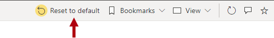

In reading view, report consumers can use many different filter techniques when viewing a Power BI report, such as:

-   Using slicers.

-   Using filters.

-   Applying interactive filtering actions.

-   Determining applied filters.

-   Working with persistent filters.

As a report author, use these filter techniques to design reports that take advantage of these capabilities, and at times, disable them (when you have good reason to do so).

## Slicers

Slicers provide an intuitive experience for report consumers. They are potentially the most-used interactive technique in Power BI reports. Report consumers can modify or clear slicer filters. They can also enable the search feature, allowing them to quickly locate specific items to filter by.

## Filters

If the **Filters** pane isn't hidden, a report consumer can open the pane to inspect the filters. When filters aren't locked, report consumers can modify them. Specifically, they can:

-   Select the eraser icon to clear the filter.

-   Apply a new filter selection.

-   Change the filter type, such as from basic to advanced (unless disabled for the report).

-   Use the search box to search for values to filter by (unless disabled for the report).

Equally as important is understanding what report consumers can't do, such as:

-   Add new filters.

-   Remove filters.

-   Change the filter type to **Top N**, or **relative date or time** (for date/time fields).

-   Enforce or disable single selection.

> [!NOTE]
>  You can add or remove filters by adding query string parameters in the URL. For more information, see [Filter a report using query string parameters in the URL](/power-bi/collaborate-share/service-url-filters/?azure-portal=true). For embedded reports, the embedding app can use the client APIs to programmatically add or remove filters and change filter types to **Top N** or **relative date or time**. For more information, see [Power BI embedded analytics Client APIs](/javascript/api/overview/powerbi/?azure-portal=true).

## Interactive filtering actions

Many report consumer interactions apply filters. These interactions can:

-   Slice to propagate filters to other visuals.

-   Include/exclude filters.

-   Cross filter.

-   Drill through to a report page.

-   Apply bookmarks.

### Include/exclude groups

Report consumers can include or exclude one or more groups in a visual. *Include* keeps the selection and removes all other groups. *Exclude* removes one or more groups from the visual.

These filters appear in the **Filters** pane as filter cards titled **Included** or **Excluded**. The report consumer can use the **Filters** pane to view, modify, or remove them.

### Cross filter

Report consumers can temporarily cross filter the visuals on the report page by selecting one or more elements in a visual.

By default, cross filtering (or cross highlighting) works between any two visuals. However, the report author can edit visual interactions between any pair of visuals and in either direction. Then, they can disable cross filtering or modify the interaction to use cross highlighting instead.

### Report page drillthrough

When the report author designs a report for drillthrough, report consumers can drill from a visual to another report page. By default, the drillthrough action propagates all filters that apply to the visual to the drillthrough page.

For example, a report consumer modifies slicer values, uses an **Include** filter to filter by a specific month, and cross filters by a specific product. These filters will propagate to the drillthrough page.

### Bookmarks

Report consumers can apply bookmarks that apply filters.

## Determine applied filters

Occasionally, report consumers want to know (or verify) what filters, if any, apply to a specific visual. They can complete that action by hovering the cursor over the Filter icon in the visual header. A pop-up window will appear, describing the filters that affect the visual. The pop-up window shows the accumulation of filters that are applied by slicers or filters, including any cross filters.

> [!div class="mx-imgBorder"]
> 

> [!NOTE]
> Hidden filters aren't visible in the pop-up window.

If the **Filter** icon isn't available for a visual, it could be because:

-   The report settings disable visual headers for the entire report.

-   The visual settings disable the visual header for the visual.

-   The visual settings disable the visual header **Filter** icon for the visual.

For more information, see [Take a tour of the report Filters pane](/power-bi/consumer/end-user-report-filter?azure-portal=true#view-only-those-filters-applied-to-a-visual).

## Persistent filters

*Persistent filters* is a feature that saves report consumer's slicer and filter settings. It automatically applies the settings when the report consumer reopens the report. That way, Power BI remembers previously applied filters. You can revert to default filters (that are saved in the report by the report author) by selecting **Reset to default**.

> [!div class="mx-imgBorder"]
> 

> [!NOTE]
> If the **Reset to default** button is not available, it could be because persistent filters is disabled for the report. This button will also reset the state of visuals, including drillthrough location and sorting.
