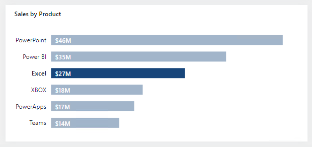

Filters and slicers are two different techniques that can achieve the same outcome.

Typically, the decision to use a filter or slicer is a tradeoff between performance and design. Consider that the **Filters** pane will perform better (because Power BI doesn't need to render slicer visuals), and it doesn't take up space on the report page. However, you should also consider that slicers have the formatting flexibility to seamlessly integrate into the report page, creating the most refined experience possible for report consumption. Many ways are available for you to format a slicer, and the most important consideration is to ensure that it fits into the report design with an intuitive placement and user experience that meets requirements.

Advantages and disadvantages that are associated with the **Filters** pane are as follows:

-   Advantages:

    -   The **Filters** pane is consistently located on the right side of the report.

    -   It allows you to configure advanced filter types, like **Top N**, or allows you to use more complex expressions, like "contains," "does not contain," "is blank," and others.

    -   The search box and sort functions (to order filters within the sections) are powerful tools to use when many filters exist.

    -   Filters result in faster report rendering because no visual rendering is required.

    -   You can lock and/or hide filters.

    -   When the **Apply** button is enabled, you can submit all filter updates at once, resulting in fewer queries.

    -   You can filter by using measures (only at visual level).

-   Disadvantages:

    -   The **Filters** pane offers less design flexibility, though you can style it by using specific fonts and colors.

    -   Careful consideration should be made to hide certain filters to avoid confusing report consumers.

    -   It can be easy to lose track of applied visual-level filters.

Advantages and disadvantages that are associated with using slicers are as follows:

-   Advantages:

    -   You can place slicers anywhere on the report page to produce an intuitive layout.

    -   Slicers are highly configurable to achieve the required functionality and style.

    -   You can configure hierarchical slicers (based on a hierarchy or by using multiple fields that are sourced from the same table).

    -   They can display their selection (filter context) directly on the report page.

    -   They can display images when you are using a field that is categorized as an image URL. For more information, see [Specify data categories in Power BI Desktop](/power-bi/transform-model/desktop-data-categorization/?azure-portal=true).

    -   They can filter only certain visuals by editing visual interactions.

    -   You can filter slicers as you would any visual. For example, you can apply a filter to a slicer to remove the BLANK item.

    -   You can sort slicer items.

    -   Synced slicers can filter other pages in the report.

-   Disadvantages:

    -   Slicers can have an impact on report render performance due to the visual render time.

    -   They occupy space on the page that could be used by data visuals.

    -   Slicer filtering options are less complex than the advanced filter options that are possible in the **Filters** pane. For example, you can't configure a **Top N** slicer.

Bear in mind that you can enable filtering by using visuals. For example, a sales by product bar chart can behave like a slicer when report consumers select a single or multiple bars. However, a downside to this approach is that some report consumers might not be aware that visuals can cross filter other visuals.

In the following bar chart, the report page is filtered by the product Excel.

> [!div class="mx-imgBorder"]
> 

## Tips

Tips to help you produce successful report designs include:

-   Use either filters or slicers. Avoid using both filter techniques because it can create confusion.

-   In the **Filters** pane, consider locking or hiding visual-level filters to avoid confusing report consumers. (Often, report consumer shouldn't modify or see visual-level filters.)

-   Create a bookmark to reset all slicers to default values. Then, add a button to the page to invoke the bookmark. For example, the button could be captioned as **Reset slicers**.

-   When a requirement is in place to lay out many slicers, consider creating a page that is dedicated to showing all slicers. For example, the page could be named **Slicers**. Sync the slicers to other pages and then set the slicers as hidden on those pages. This design technique will require that report consumers should always go to the **Slicers** page to modify slicer settings. To help them, you can add a page navigation button at a consistent location on each page so that they can easily return to the **Slicers** page.

-   Consider using other visuals in place of slicers. Be sure to teach report consumers how to cross filter by using these visuals.

For more information, see [Create buttons in Power BI reports](/power-bi/create-reports/desktop-buttons/?azure-portal=true).

For more information, see [Create page navigation](/power-bi/create-reports/desktop-buttons?azure-portal=true#create-page-navigation).