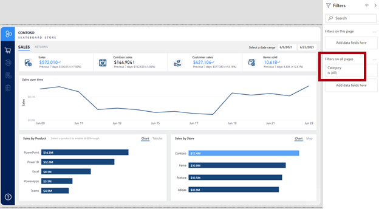
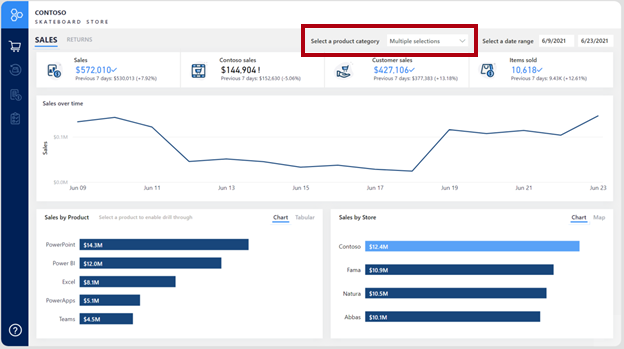
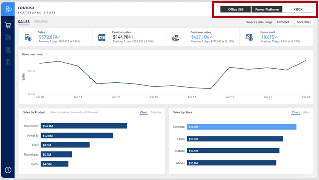
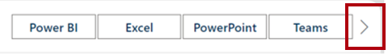

At the Contoso Skateboard Company, the sales director has requested an update to the **Sales** analytic report. Specifically, the main report page, which focuses on sales for a specific date range, should also allow filtering by one or more product categories.

The first attempt added the **Category** field to the **Filters on all pages** section of the **Fields** pane. The report author decided that it was a quick and easy update to make.

> [!div class="mx-imgBorder"]
> 

However, feedback from the sales director and salespeople wasn't positive. Some report consumers couldn't easily locate the filter. Others were frustrated that the filter wasn't visible on the report page so that they could see and understand the filter selection.

A second attempt resulted in the removal of the **Category** page-level filter. A dropdown list slicer was then added across the top of the report page.

> [!div class="mx-imgBorder"]
> 

Nevertheless, feedback from the sales director and salespeople still wasn't positive. They complained that when they filtered the page by multiple category items, the dropdown slicer read "Multiple selections," meaning that they needed to expand the dropdown slicer to determine the filtered categories.

A third (and final) attempt resulted in repositioning the product category slicer in the upper-right corner of the page and then changing the orientation to horizontal. This way, the slicer always shows the three different categories and the item selection(s).

> [!div class="mx-imgBorder"]
> 

> [!TIP]
> Take care not to use horizontal orientation when many distinct values are present. Often, report consumers don't notice the scroll arrows that allow navigation to the following items. Consequently, they might think that the value they're looking for doesn't exist.

> [!div class="mx-imgBorder"]
> 

This case study describing the evolution of a report design serves as a good reminder that many techniques are available for filtering a report. What matters is that your report design allows report consumers to intuitively and quickly narrow down to the data points that interest them.

