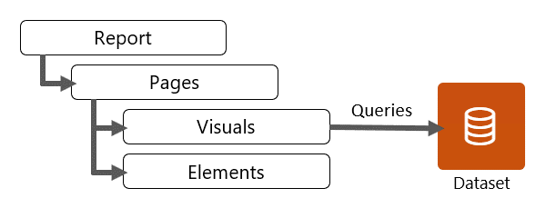

You can design Microsoft Power BI reports in Power BI Desktop or Power BI service (web portal). Power BI mobile apps don't support report design; they support only the report consumer experience.

> [!NOTE]
> Power BI Desktop is only supported on Windows operating systems. As a design tool, it also supports the development of reports and data models. In this module, the focus is only on report design.

## Report structure

Structurally, a Power BI report connects to a single dataset (data model), and it has at least one report page. However, it's common that reports have multiple pages. On each page, *report objects* are laid out. Report objects include:

- **Visuals** - Visualizations of dataset data.

- **Elements -** Provide visual interest but don't use dataset data. Elements include text boxes, buttons, shapes, and images.

> [!div class="mx-imgBorder"]
> 

## Report pages

Similar to Microsoft Excel worksheets, you can add, rename, resequence, hide, duplicate, or delete Power BI report pages.

> [!TIP]
> Duplicating pages can help expedite report development, especially when you're copying a completed and polished report page. However, take care that you don't over complicate the report design if you can accomplish a duplicated page by filtering a single page. For example, instead of creating one page for each customer, you could use a slicer on a single page to filter by customer.

Report consumers navigate to a visible page by selecting a page tab (in Power BI Desktop) or by selecting the page in the **Pages** pane (in Power BI service).

The decision to create more pages depends on your report requirements. Strive for a report design that expresses the data in a logical flow on the page and between pages. A well-designed report often provides a high-level summary on the first page with supporting detail on the following pages.

Occasionally, it might make sense to have a single report with many pages. Other times, it could make sense to separate pages into different reports. This scenario is especially true when you design those pages for a different audience or when you need to secure, share, or distribute them differently. The reason is because reports are a security and publication unit, and report pages belong to reports and can't be secured or published independently of the report.

You can hide pages when they're not yet ready for use; they're a *work in progress*. However, you might commonly hide them because you want to control how they're accessed. You can provide report page navigation with buttons or by drilling through from a visual. It's also possible to design a page as a tooltip, which is revealed when a report consumer hovers over a visual.

You can configure various page-level settings, which can be set in the **Format** options. Commonly applied settings include page information, page size, and page background.
