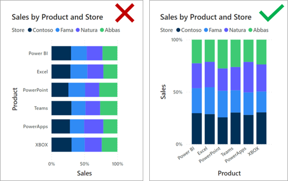

Often, you can choose between multiple visual types to meet design requirements. To narrow down the selection, you can choose the visual that best fits the available space on the report page. Use a visual that is aesthetically pleasing while maximizing the use of the available page space.

The following examples show two visuals side by side: a 100% Stacked Bar chart visual and a 100% Stacked Column chart visual. Each visual shows the same data and occupies the same space on the page. One visual is easier to read. In this instance, the 100% Stacked Bar chart visual helps make it easier for you to determine relative values and trend. The reason is because the visuals occupy a wide yet short area: The lengths of the *long* bars are easier to interpret than the heights of the *short* columns.

> [!div class="mx-imgBorder"]
> 

This situation isn't always the case. When the visual needs to fill a narrow yet tall space, the 100% Stacked Column chart is more effective. The heights of the *tall* columns are easier to interpret than the lengths of the *short* bars.

> [!div class="mx-imgBorder"]
> 
