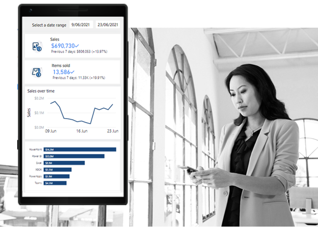
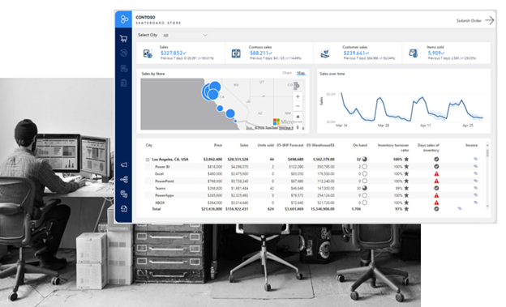

Identifying the audience is one of the most important steps in the report design process. It enables the report author to create a final result that can be efficiently used and will meet the needs of the report consumer.

The three broad report consumer audiences are:

- Executive

- Analyst

- Information worker

An **executive** is a person who is charged with making plans and decisions that often involve a medium or long-term focus. Executives are responsible for making the business run smoothly. For example, the C-level executives at the Contoso Skateboard Store would be an executive audience.

> [!div class="mx-imgBorder"]
> 

An **analyst** is a person who provides guidance to the organization. Analysts can be responsible for a range of tasks, often with goals of determining the effectiveness of business strategies, developing or improving processes, or implementing change. A business analyst (or data analyst) in the sales division of the Contoso Skateboard Store is an example of an analyst audience.

> [!div class="mx-imgBorder"]
> 

An **information worker** is someone who uses data to help make decisions or take actions. Often, these decisions and actions are operational in that they are done on a daily basis. The inventory manager at the Contoso Skateboard Store, who needs up-to-date information about stock levels, is an example of an information worker audience.

> [!div class="mx-imgBorder"]
> 